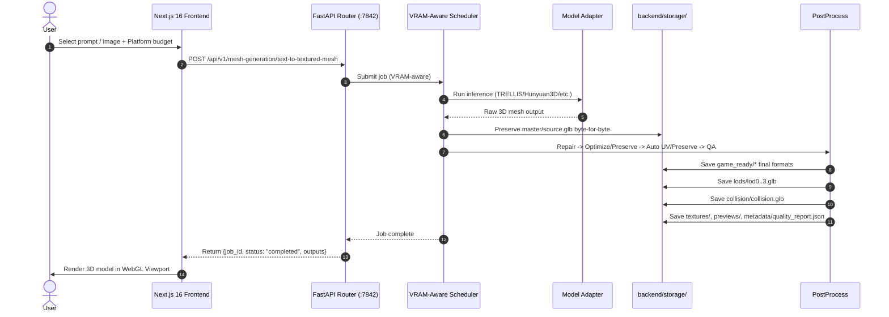

# Architecture — ForMash 3D

> **Architecture Version**: 0.2.0 (FastAPI + Next.js 16)
> **Last Verified**: September 29, 2026
> **Target Environments**: Linux (Ubuntu 20.04/22.04/24.04), Cloud GPU / Local Workstations

---

## 1. Architectural Mission & Overview

ForMash 3D is an end-to-end generative 3D asset pipeline. The system is architected around a clean separation of concerns:

- **Presentation Layer**: Next.js 16 frontend with interactive Three.js 3D viewport, studio workspace tooling, and model management.
- **API Gateway**: FastAPI backend (Python 3.10, Conda env `3daigc-api`) with VRAM-aware multiprocess scheduler, request validation, rate limiting, and static file delivery.
- **Model Adapters**: Python adapters for each AI model (TRELLIS, Hunyuan3D-Shape-v2-1, Hunyuan3D-Paint-v2-1, Hunyuan3D-DiT-v2-mini-Turbo, PartPacker, UltraShape, PartField, UniRig, TripoSR, TripoSG, TripoSF, ARDY, FastMesh, VoxHammer). The Paint-v2-1 pipeline supports Shape→Paint automatic chaining with configurable texture resolution (512/768), max view counts (6-12), PBR state tracking, and VRAM-aware scheduling.
- **Scheduler**: VRAM-aware scheduler with GPU monitoring and optional Redis multi-worker queue.

```mermaid
flowchart TB
    classDef layer fill:#0f172a,stroke:#64748b,stroke-width:1px,color:#94a3b8
    classDef node fill:#1e293b,stroke:#3b82f6,stroke-width:2px,color:#fff
    classDef db fill:#1e293b,stroke:#ec4899,stroke-width:2px,color:#fff
    classDef store fill:#1e293b,stroke:#10b981,stroke-width:2px,color:#fff

    subgraph LAYER["Frontend Layer"]
        direction TB
        NEXT["Next.js 16 :3000<br/>React 19 + TypeScript"]:::node
        VPORT["3D Viewport<br/>Three.js / R3F"]:::node
        CONTROLS["Generation Controls<br/>LOD / Budget / Export"]:::node
    end

    subgraph GW["API Gateway Layer"]
        direction TB
        API["FastAPI Gateway :7842<br/>Routers + CORS + Rate Limit"]:::node
        ROUTERS["API Routers<br/>system · file-upload<br/>mesh-generation · mesh-editing<br/>motion-generation · auto-rigging<br/>mesh-segmentation · mesh-retopology<br/>mesh-uv-unwrapping · users"]:::node
        SCHED["VRAM-Aware Scheduler<br/>GPU Mutual Exclusion"]:::node
        STATIC["Static File Delivery<br/>/static Binary Streaming"]:::node
    end

    subgraph CORE["Model Execution Layer"]
        direction TB
        ADAPTERS["Model Adapters<br/>TRELLIS · Hunyuan3D · PartPacker<br/>UltraShape · PartField · UniRig<br/>TripoSR · TripoSG · ARDY<br/>FastMesh · VoxHammer"]:::node
        GPU_MON["GPU Monitor<br/>VRAM / Temperature"]:::node
        VRAM_BUF["VRAM Safety Buffer<br/>1GB Free Margin"]:::node
    end

    subgraph DATA["Storage Layer"]
        direction TB
        FILESTORE["Redis FileStore<br/>Cross-Worker Metadata"]:::store
        LOCAL["Canonical Asset Workspace<br/>backend/storage/models/<asset_name>_<job_hash>/"]:::store
        UPLOADS["Upload Bucket<br/>backend/storage/uploads/"]:::store
    end

    subgraph OPT["Optional Services"]
        direction TB
        REDIS["Redis 7 :6379<br/>Multi-Worker Queue"]:::db
    end

    LAYER -->|"REST / SSE / WS"| GW
    API --> ROUTERS
    API --> SCHED
    SCHED --> ADAPTERS
    SCHED --> GPU_MON
    SCHED --> VRAM_BUF
    ADAPTERS -->|Raw Mesh| DATA
    SCHED --"Job Queue"| OPT
    STATIC -->|"Binary Delivery"| LAYER

    style LAYER fill:#0f172a
    style GW fill:#0f172a
    style CORE fill:#0f172a
    style DATA fill:#0f172a
    style OPT fill:#0f172a
```

---

## 2. Component Layers

### 2.1 Presentation Layer (Next.js 16)

| Component | Path | Description |
|---|---|---|
| **App Router** | `app/` | Next.js 16 App Router with server components, layouts, and API proxy routes |
| **Workspace Shell** | `features/workspace/WorkspaceShell.tsx` | Main workspace UI with tabbed panels and model viewport |
| **API Client** | `services/apiClient.ts` | Unified axios client for all FastAPI backend REST/SSE communication |
| **3D Canvas** | `features/workspace/Viewport/MeshViewer.tsx` | Three.js WebGL viewport with orbit controls, wireframe/matcap shading, physics smoke test, and opt-in mirror inspection |
| **State Stores** | `stores/` | Zustand stores for global client state (`useAppStore`, `useViewerStore`, `useAnimationStore`, `useRiggingStore`, `useUIStore`) |
| **Data Fetching** | hooks + TanStack Query | Server-state caching and synchronization for job status |

### 2.2 API Gateway Layer (FastAPI)

Located at `backend/api/`:
- **Entry Points**: `main_singleworker.py` (embedded scheduler) and `main_multiworker.py` (Redis queue). Python 3.10 via Conda env `3daigc-api`.
- **API Routers**: REST controllers for system info, file upload, mesh generation/editing, auto-rigging, segmentation, retopology, UV unwrapping, and user management.
- **Configuration** (`backend/core/config.py`): Pydantic V2 settings loaded from `.env` and YAML config files (`system.yaml`, `models.yaml`).
- **Static File Server**: Optimized binary streaming for 3D formats (`.glb`, `.gltf`, `.fbx`, `.obj`, `.stl`) with cache headers.
- **Auth Service** (`backend/core/auth/`): Optional Redis-based authentication controlled by `P3D_USER_AUTH_ENABLED`.

### 2.3 Model Execution Layer

| Component | Path | Description |
|---|---|---|
| **Scheduler Factory** | `backend/core/scheduler/scheduler_factory.py` | Creates dev/prod scheduler instances |
| **Multiprocess Scheduler** | `backend/core/scheduler/multiprocess_scheduler.py` | VRAM-aware scheduler with GPU mutual exclusion |
| **GPU Monitor** | `backend/core/scheduler/gpu_monitor.py` | Real-time VRAM and temperature polling |
| **Job Queue** | `backend/core/scheduler/job_queue.py` | Job request models and types |
| **Redis Job Queue** | `backend/core/scheduler/redis_job_queue.py` | Redis-backed distributed job queue (multi-worker with bounded 20-connection pool) |
| **Model Adapters** | `backend/adapters/` | Python inference adapters (TRELLIS, Hunyuan3D-Shape-v2-1, Hunyuan3D-Paint-v2-1, Hunyuan3D-DiT-v2-mini-Turbo, PartPacker, UltraShape, PartField, UniRig, TripoSR, TripoSG, TripoSF, ARDY, FastMesh, VoxHammer) |
| **Paint-v2-1 Pipeline** | `backend/adapters/hunyuan3d_paint_v21.py` | Hunyuan3D-Paint-v2-1 adapter with RealESRGAN x4+ super-resolution, DifferentiableRenderer for PBR validation, VRAM status tracking, and Shape→Paint automatic chaining support |

### 2.4 Storage Layer

Located at `backend/storage/`:
- **Uploads** (`uploads/`): User-uploaded reference images (`.png`, `.jpg`, `.webp`).
- **Models** (`models/<asset_name>_<job_hash>/`): Canonical per-generation asset workspaces.
- **Asset workspace**: `master/`, `game_ready/`, `lods/`, `collision/`, `textures/`, `previews/`, and `metadata/`.
- **ZIP delivery**: Generated on demand from the canonical workspace; no persistent `exports/` tree is required.

### 2.5 Local Wheelhouse

Prebuilt wheels are cached at `backend/thirdparty/wheels/` (inside the main ForMash3D repository). The `download_and_install_release_wheels()` function in `scripts/setup.sh` fetches all `.whl` files from the `ForMash3D/releases/tag/Wheels` GitHub Release and installs them. The install script (`backend/scripts/install.sh`) uses `--find-links="$WHEEL_DIR"` to prefer local prebuilt wheels when installing dependencies, falling back to PyPI/index/Git when no compatible wheel exists. Wheels are automatically downloaded from the ForMash3D GitHub Release at runtime into `backend/thirdparty/wheels/`.

---

## 3. Performance Optimizations

| Optimization | Target Layer | Mechanism | Impact |
|---|---|---|---|
| **GPU Mutual Exclusion** | Scheduler | Strict process locking | Prevents GPU OOM during concurrent inference |
| **GPU Monitoring** | Scheduler | Real-time VRAM/temperature polling | Dynamic scheduling decisions |
| **VRAM Safety Buffer** | Scheduler | `VRAM_SAFETY_MARGIN_MB=1024` | Ensures 1GB free margin after each job |
| **Auto Unload** | Scheduler | `AUTO_UNLOAD_AFTER_JOB=true` | Frees VRAM between jobs |
| **Connection Reuse** | Frontend | Axios singleton (`services/apiClient.ts`) | Eliminates per-request overhead |
| **SSE Streaming** | API Gateway | Server-Sent Events for progress | Real-time feedback without polling |
| **Tensor Core Acceleration** | Backend | `torch.backends.cuda.matmul.allow_tf32 = True` | 3x-8x matmul speedup on Ampere/Ada/Hopper |
| **Inference Mode** | Backend | `torch.inference_mode()` | Eliminates autograd graph tracking overhead |
| **ORJSON Serialization** | Backend | `ORJSONResponse` with fallback | 10x-20x faster JSON serialization |
| **GZip Compression** | Backend | `GZipMiddleware(minimum_size=1000)` | 75-85% response size reduction |
| **Browser Caching** | Backend | `Cache-Control` headers | Reduces repeated asset downloads |
| **Code-Splitting** | Frontend | `next/dynamic` with skeleton fallbacks | Reduced initial bundle size |
| **Font Optimization** | Frontend | `next/font/google` with `display: 'swap'` | Eliminates CLS and render blocking |

---

## 4. End-to-End Generation Request Flow



---

## 5. Storage Directory Organization

```mermaid
flowchart LR
    classDef dir fill:#1e293b,stroke:#3b82f6,stroke-width:2px,color:#fff
    classDef file fill:#0f172a,stroke:#64748b,stroke-width:1px,color:#cbd5e1

    ROOT["backend/storage/"]:::dir --> UPLOADS["uploads/<br/>Reference Images"]:::dir
    ROOT --> MODELS["models/<asset_name>_<job_hash>/<br/>Canonical Asset Workspace"]:::dir
    ROOT --> THUMBS["thumbnails/<br/>Preview PNGs"]:::dir

    MODELS --> SRC["source.glb<br/>Untouched Master"]:::file
    MODELS --> GAME["game_ready.glb<br/>Engine-Optimized"]:::file
    MODELS --> LODS["lods/<br/>lod0–lod3.glb"]:::dir
    MODELS --> COL["collision.glb<br/>Convex Hull"]:::file
    MODELS --> QA["quality_report.json<br/>QA 0-100 Score"]:::file

    UPLOADS --> IMG["*.png *.jpg *.webp"]:::file
    EXPORTS --> ZIP["Project_Export_[job_id].zip"]:::file

    style ROOT fill:#0f172a
```



---

## 6. Service Lifecycle Management

### 6.1 Installation (`backend/scripts/install.sh`)

The install script creates the Conda env `3daigc-api` (Python 3.10) and installs:
- PyTorch 2.6.0 + CUDA 12.4 (from `https://download.pytorch.org/whl/cu124`)
- All thirdparty model dependencies (TRELLIS.2, PartField, Hunyuan3D-Shape-v2-1, Hunyuan3D-Paint-v2-1, Hunyuan3D-DiT-v2-mini-Turbo, UniRig, PartPacker, PartUV, P3-SAM, FastMesh, UltraShape, VoxHammer)
- Main project dependencies (from `backend/requirements.txt`)
- System packages (`libsm6`, `libegl1`, `libgl1-mesa-dev`)
- RealESRGAN_x4plus.pth for Hunyuan3D-Paint-v2-1 super-resolution
- DifferentiableRenderer native modules for Hunyuan3D-Paint-v2-1 PBR validation

Build isolation is disabled globally (`PIP_NO_BUILD_ISOLATION=1`, `UV_NO_BUILD_ISOLATION=1`) — required for building flash-attn, nvdiffrast, nvdiffrec, CuMesh, FlexGEMM, o-voxel, cubvh, and bpy-renderer.

### 6.2 Startup (`scripts/start.sh` / `manager.sh`)

```mermaid
flowchart LR
    classDef step fill:#1e293b,stroke:#8b5cf6,stroke-width:2px,color:#fff
    classDef service fill:#0f172a,stroke:#10b981,stroke-width:2px,color:#fff

    A["scripts/start.sh<br/>Launcher"]:::step --> B{"Single or<br/>Multi-Worker?"}:::step
    B -->|Single| C["Uvicorn<br/>main_singleworker:app<br/>:7842"]:::service
    B -->|Multi| D["Redis Server<br/>:6379"]:::service
    D --> E["Scheduler Service<br/>python scheduler_service.py"]:::service
    E --> F["Uvicorn Workers x4<br/>main_multiworker:app<br/>:7842"]:::service
    C --> G["Next.js Dev Server<br/>:3000"]:::service
    F --> G

    style A fill:#1e293b,stroke:#8b5cf6
    style B fill:#1e293b,stroke:#f59e0b
```



**Single-Worker Mode** (default):
```bash
cd backend && conda activate 3daigc-api
uvicorn api.main_singleworker:app --workers 1 --port 7842
```

**Multi-Worker Mode** (Redis Queue):
```bash
redis-server
conda activate 3daigc-api
python backend/scripts/scheduler_service.py
cd backend && conda activate 3daigc-api
uvicorn api.main_multiworker:app --workers 4 --port 7842
```

### 6.3 Shutdown (`scripts/stop.sh`)
- Gracefully terminates Next.js, Uvicorn, and Redis processes.
- Releases TCP ports 3000, 7842, and 6379.
- Cleans up stale PID files.

---

## 7. API Endpoints

### System & Health
- `GET /health`: Health check with timestamp and status.
- `GET /api/v1/system/health`: Extended system health.
- `GET /api/v1/system/info`: Host hardware specs, OS, RAM, GPU telemetry.
- `GET /api/v1/system/models`: Model registry with VRAM budgets and weights status.
- `GET /api/v1/system/jobs/history`: Job history with search and status filtering.

### File Upload & Storage
- `POST /api/v1/file-upload/image`: Upload reference image.
- `POST /api/v1/file-upload/mesh`: Upload base mesh for post-processing.
- `GET /api/v1/file-upload/download/{file_id}`: Stream stored file.

### Mesh Generation & Processing
- `POST /api/v1/mesh-generation/image-to-raw-mesh`: Geometry synthesis from image.
- `POST /api/v1/mesh-generation/image-to-textured-mesh`: Full PBR geometry + texture from models that natively implement the feature.
- Hunyuan3D Shape→Paint: Shape-v2-1 or DiT-v2-mini-Turbo uses `image-to-raw-mesh`, then optionally chains into `hunyuan3d_paint_v21_image_mesh_painting` after geometry completion.
- `POST /api/v1/mesh-generation/text-to-raw-mesh`: Geometry synthesis from text.
- `POST /api/v1/mesh-generation/image-mesh-painting`: Paint textures onto mesh (Hunyuan3D-Paint-v2-1).
- `GET /api/v1/mesh-generation/status/{job_id}`: Real-time generation job status.
- `POST /api/v1/mesh-generation/cancel/{job_id}`: Cancel a running job.
- `POST /api/v1/mesh-generation/cost-estimate`: Estimate VRAM and time cost.
- `GET /api/v1/system/jobs/{job_id}/download?artifact_format=<format>`: Deliver canonical master, game-ready, LOD, collision, texture, preview, QA, or ZIP artifacts.

### Mesh Editing, Rigging, Segmentation, Retopology, UV
- `POST /api/v1/mesh-editing/text-edit`: Edit mesh with text prompt.
- `POST /api/v1/mesh-editing/image-edit`: Edit mesh with image reference.
- `POST /api/v1/auto-rigging/generate-rig`: Generate skeletal rig with UniRig.
- `POST /api/v1/mesh-segmentation/segment-mesh`: Decompose mesh into parts.
- `POST /api/v1/mesh-retopology/retopology-mesh`: Retopologize dense mesh.
- `POST /api/v1/mesh-uv-unwrapping/unwrap-mesh`: Generate UV atlas.

### Motion Generation
- `POST /api/v1/motion-generation/generate-motion`: Synthesize 3D human motion from text.
- `GET /api/v1/motion-generation/checkpoints`: Query installed ARDY checkpoints.

---

## 8. Model Catalog

| Model Architecture | Registered Adapters | Category / Tasks | VRAM Budget |
|---|---|---|---|
| **Hunyuan3D-Shape-v2-1** | `hunyuan3d_shape_v21_image_to_raw_mesh` | Raw Mesh | ~10 GB |
| **Hunyuan3D-Paint-v2-1** | `hunyuan3d_paint_v21_image_mesh_painting` | PBR Texture | ~21 GB |
| **Hunyuan3D-DiT-v2-mini-Turbo** | `hunyuan3d_dit_v2_mini_turbo_image_to_raw_mesh` | Raw Mesh | ~6 GB |
| **Hunyuan3D-2.1 (Legacy)** | `hunyuan3dv21_image_to_raw_mesh`, `hunyuan3dv21_image_to_textured_mesh`, `hunyuan3dv21_image_mesh_painting` | Raw & Textured Mesh | 8–19.5 GB |
| **TRELLIS** | `trellis_text_to_textured_mesh`, `trellis_image_to_textured_mesh`, `trellis_text_mesh_painting`, `trellis_image_mesh_painting` | Text/Image to Mesh, Mesh Painting | 11.5 GB |
| **TRELLIS.2** | `trellis2_image_to_textured_mesh`, `trellis2_image_mesh_painting` | Structured 3D & Painting | 23.5 GB |
| **TripoSR** | `triposr_image_to_raw_mesh` | Single-Image to Mesh | 6 GB |
| **TripoSG** | `triposg_image_to_raw_mesh` | Image & Scribble to Mesh | 8 GB |
| **TripoSF** | `triposf_image_to_raw_mesh` | SparseFlex Mesh | 12 GB |
| **ARDY** | `ardy_motion_generation` | Motion AI | 8 GB |
| **PartPacker** | `partpacker_image_to_raw_mesh` | Part-Level Image to Mesh | 10 GB |
| **UltraShape** | `ultrashape_image_to_raw_mesh` | Arbitrary-Topology Mesh | 26.6 GB |
| **PartField** | `partfield_mesh_segmentation` | Mesh Segmentation | 4 GB |
| **P3-SAM** | `p3sam_mesh_segmentation` | High-Precision Segmentation | 60 GB |
| **UniRig** | `unirig_auto_rig` | Auto-Rigging | 9 GB |
| **FastMesh** | `fastmesh_v1k_retopology`, `fastmesh_v4k_retopology` | Mesh Retopology | 16–24.5 GB |
| **PartUV** | `partuv_uv_unwrapping` | UV Unwrapping | 7 GB |
| **VoxHammer** | `voxhammer_text_mesh_editing`, `voxhammer_image_mesh_editing` | Text/Image Mesh Editing | 40 GB |

---

## 9. Third-Party Source Repositories

Each model integration has its own third-party source directory under `backend/thirdparty/`:

```
backend/thirdparty/
├── hunyuan3d-shape-v2-1/    # Hunyuan3D-Shape-v2-1 (3.3B shape)
├── hunyuan3d-paint-v2-1/    # Hunyuan3D-Paint-v2-1 (2B PBR texture, RealESRGAN, DifferentiableRenderer)
├── hunyuan3d-dit-v2-mini-turbo/  # Hunyuan3D-DiT-v2-mini-Turbo (0.6B)
├── TRELLIS/
├── TRELLIS.2/
├── PartField/
├── PartPacker/
├── PartUV/
├── FastMesh/
├── UltraShape/
├── UniRig/
├── VoxHammer/
├── TripoSR/
├── TripoSG/
├── TripoSF/
├── ardy/
└── wheels/
```

---

## 10. Configuration Files

### system.yaml (`backend/config/system.yaml`)
```yaml
logging:
  level: "INFO"
  format: "%(asctime)s - %(name)s - %(levelname)s - %(message)s"
  file: null

security:
  rate_limit_per_minute: 60
  cors_origins: ["*"]
  api_key_required: false

environment: "production"
debug: false

user_auth_enabled: false
```

### models.yaml (`backend/config/models.yaml`)
Each feature maps model IDs to configurations with `vram_requirement`, `supported_inputs`, `supported_outputs`, `model_path`, `enabled`, and `max_workers`.

---

## 11. Verification & Self-Checks

```bash
# Health check
curl -s http://localhost:7842/health | jq .

# TypeScript type check
npx tsc --noEmit

# Frontend build test
bun run build

# Python syntax check
python3 -m compileall backend/api backend/core backend/adapters

# Shell script syntax check
bash -n backend/scripts/install.sh
```

---

## 12. Design Decisions

### ADR-001: Lazy Adapter Loading
**Decision**: All model adapters use lazy imports inside `_load_model()` to prevent cascading import failures.
**Reason**: Optional heavy packages (`accelerate`, `cv2`, `yacs`) should not prevent other models from loading.

### ADR-002: VRAM-Aware Scheduling
**Decision**: Strict GPU mutual exclusion with 1GB safety margin.
**Reason**: Prevents OOM crashes during concurrent inference on shared GPUs.

### ADR-003: Source Asset Immutability
**Decision**: `source.glb` is preserved byte-for-byte as an untouched master archive.
**Reason**: Enables reproducibility and rollback to original geometry.

### ADR-004: Local-First Architecture
**Decision**: All processing runs locally; no cloud dependencies.
**Reason**: Privacy, offline capability, and cost control.

### ADR-005: Zustand for Client State
**Decision**: Zustand stores for global client state instead of Redux or Context.
**Reason**: Minimal boilerplate, fast selectors, easy middleware integration.

### ADR-006: Next.js App Router
**Decision**: Next.js 16 App Router with server components.
**Reason**: Built-in data fetching, layouts, and API proxy routes.

### ADR-007: Bun as Frontend Package Manager
**Decision**: Bun as authoritative frontend package manager.
**Reason**: Faster than npm/yarn, compatible with npm ecosystem.

### ADR-008: Conda for Python Environment
**Decision**: Conda env `3daigc-api` for Python 3.10 + PyTorch 2.6.0 + CUDA 12.4.
**Reason**: Reproducible GPU environment, easy dependency management.

### 2.5 Post-Processing Engine

The production post-processing engine lives under backend/postprocess/. Successful mesh-generation jobs run this engine before the job is marked completed.

Pipeline: MASTER RAW -> Repair -> Optimize/Preserve -> Auto UV/Preserve -> GAME READY -> LOD -> collision -> preview -> QA. Native textured outputs keep their source materials and UVs; raw outputs receive geometry optimization and production UVs. Post-processing does not synthesize textures. Texture creation happens only in model-native textured generation or the dedicated Texture page.

The main runtime remains Python 3.10 + PyTorch 2.6.0 + CUDA 12.4. Blender-dependent FBX, GLTF, and thumbnail work runs in an isolated headless Blender process through BLENDER_EXECUTABLE and is best-effort for generation completion.

## Physics layer
Physics is an opt-in layer after the existing generation and production post-processing pipeline. The immutable master remains unchanged. When requested, the scheduler passes a provider-neutral physics intent into post-processing; the existing collision service produces the collision representation and `metadata/physics.json` records the rigid-body configuration, material response, collision statistics, provenance, and capabilities. The browser viewer uses the canonical collision artifact with pinned Rapier 0.19.3 while remaining on the existing direct Three.js renderer. Physics preparation is skipped for intermediate Shape output in Shape→Paint auto-chaining and runs only on the final output. The physics runtime is not an inference model and does not consume generation-model VRAM.
