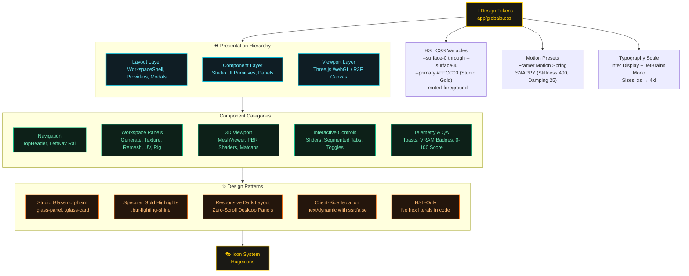
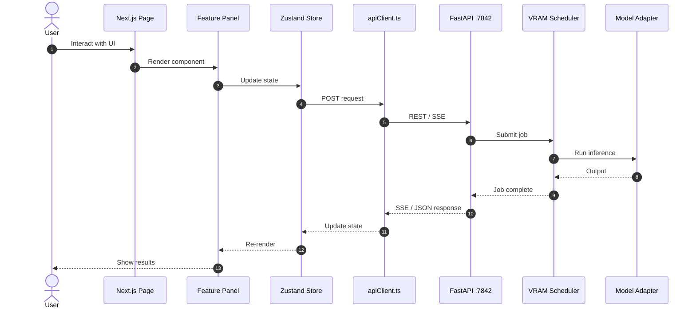

# UI Design System & Component Reference

> **Design Version**: 0.1.0
> **Last Updated**: October 3, 2026
> **Design System**: Studio Gold (`#FFCC00`, `48 100% 50%`) on Matte Black (`#080808`)

---

## 1. Design Tokens (`app/globals.css`)

All colors and surfaces in ForMash 3D use HSL CSS variable design tokens. Direct hex color literals in UI code are strictly disallowed.

| Token | CSS Variable Value | Hex / Color Equivalent | Purpose / Usage |
| :--- | :--- | :--- | :--- |
| `background` | `0 0% 3.1%` | `#080808` | Global Matte Black app backdrop / canvas shell base |
| `foreground` | `0 0% 96%` | `#F5F5F5` | Primary high-contrast typography (clean crisp white) |
| `--surface-0` | `0 0% 2.4%` | `#060606` | Deepest surface (3D viewport, canvas background) |
| `--surface-1` | `0 0% 6.7%` | `#111111` | Primary panel backgrounds, cards, navigation rails |
| `--surface-2` | `0 0% 10.2%` | `#1A1A1A` | Secondary containers, active tabs, nested sub-panels |
| `--surface-3` | `0 0% 14.1%` | `#242424` | Hovered interactive states, input backgrounds |
| `--surface-4` | `0 0% 20%` | `#333333` | Raised borders, highlighted elements |
| `--primary` | `48 100% 50%` | `#FFCC00` | Vivid Studio Electric Gold (high-saturation, maximum LCD punch) |
| `--primary-foreground`| `0 0% 3%` | `#080808` | High-contrast dark typography on primary yellow (>12:1 WCAG contrast) |
| `--accent-dark` | — | `#E09800` | Pressed states, gradient bottom stop |
| `--accent-light` | — | `#FFE066` | Hover states, specular highlight top stop |
| `--border` | `0 0% 20%` | `#333333` | Standard card and container borders |
| `--muted-foreground` | `0 0% 63%` | `#A0A0A0` | Readable secondary/placeholder typography (>4.5:1 WCAG AA) |
| `--chart-gpu` | `48 100% 50%` | `#FFCC00` | Telemetry GPU telemetry line |
| `--chart-vram`| `48 100% 70%`| `#FFE066` | Telemetry VRAM telemetry line |
| `--chart-cpu` | `0 0% 75%` | `#BFBFBF` | Telemetry CPU telemetry line |
| `--chart-temp`| `40 100% 44%`| `#E09800` | Telemetry temperature line |
| Semantic Success | — | `#22C55E` / `emerald-400` | Online status, completed jobs, healthy checks |
| Semantic Warning | — | `#FFCC00` / `amber-400` | Degraded service, queue wait |
| Semantic Destructive | `0 72% 56%` | `#EF4444` / `rose-500` | Errors, deletion modals, fatal logs |
| Semantic Info | — | `#3B82F6` / `sky-400` | Info notices, informative tooltips |

### Color Palette Visual Reference


> The `assets/colors.jpeg` image shows the complete color palette used across the ForMash 3D UI, including Studio Gold (`#FFCC00`), Matte Black (`#080808`), and all HSL design tokens.

---

## 2. Design System Architecture



---

## 2a. Icon System

**Primary Icon Library**: [Hugeicons](https://hugeicons.com) (`@hugeicons/react` + `@hugeicons/core-free-icons`).

> No other icon libraries are permitted. Custom SVGs are restricted to brand/logo assets only.

### Icon Size Hierarchy

| Size | CSS Class | Pixel Value | Usage |
| :--- | :--- | :--- | :--- |
| 12px | `h-3 w-3` | 12 | Inline status, compact badges |
| 14px | `h-3.5 w-3.5` | 14 | Secondary actions, refined inline |
| 16px | `h-4 w-4` | 16 | Default UI controls, buttons |
| 18px | `h-[18px] w-[18px]` | 18 | Enhanced inline, refined action |
| 20px | `h-5 w-5` | 20 | Featured actions, highlights |
| 24px | `h-6 w-6` | 24 | Card-level, panel actions |
| 28px+ | `h-7+ w-7+` | 28+ | Hero, empty states |

### Icon Usage Patterns

**With Text** (button):
```tsx
<HugeiconsIcon icon={PlayIcon} size={16} className="w-4 h-4 mr-2" />
<span>Generate</span>
```

**Icon-Only** (button):
```tsx
<button>
  <HugeiconsIcon icon={Settings01Icon} size={16} className="h-4 w-4" />
</button>
```

**Decorative** (background/empty):
```tsx
<HugeiconsIcon icon={BoxIcon} size={20} className="text-primary opacity-80" />
```

### Accessibility Requirements

- **Icon-only buttons** require `aria-label`.
- **Decorative icons** require `aria-hidden="true"`.
- **Interactive icons** should be wrapped in `SimpleTooltip` where appropriate.

### Lucide → Hugeicons Name Mapping

Key mappings (see `components/icons/hugeicons-mapping.ts` for the full list):

| Lucide Name | Hugeicons Name |
| :--- | :--- |
| `ArrowLeft` | `ArrowLeft01` |
| `ArrowRight` | `ArrowRight01` |
| `ChevronDown` | `ChevronDown` |
| `ChevronRight` | `ChevronRight` |
| `X` | `Cancel01` |
| `Check` | `Check` |
| `CheckCircle` | `CheckmarkCircle01` |
| `Loader2` | `LoaderCircle` |
| `Search` | `Search01` |
| `Settings` | `Settings01` |
| `Upload` | `Upload01` |
| `Download` | `Download01` |
| `RefreshCw` | `RefreshCw` |
| `Box` | `Box` |
| `Layers` | `Layers01` |
| `Cpu` | `Cpu` |
| `HardDrive` | `HardDrive` |
| `Eye` | `Eye` |
| `EyeOff` | `EyeOff` |
| `AlertCircle` | `AlertCircle` |
| `AlertTriangle` | `TriangleAlert` |
| `Zap` | `Zap` |
| `Flame` | `Flame` |
| `Database` | `Database01` |
| `Gauge` | `Gauge` |
| `Sparkles` | `Sparkles` |
| `Wand` | `MagicWand01` |
| `Lock` | `Lock` |
| `LockOpen` | `LockOpen` |
| `Shield` | `Shield01` |
| `ShieldCheck` | `ShieldCheck` |
| `Heart` | `Heart` |

---

---

## 3. Motion Presets (`lib/motion.ts`)

Universal motion specifications compatible with `motion/react`:

- `MOTION_FAST`: `{ duration: 0.15, ease: [0.16, 1, 0.3, 1] }` — Tooltips, micro-hovers, toggles.
- `MOTION_BASE`: `{ duration: 0.2, ease: [0.16, 1, 0.3, 1] }` — Tab transitions, dropdown menus.
- `MOTION_SLOW`: `{ duration: 0.3, ease: [0.16, 1, 0.3, 1] }` — Modal entry/exit, panel expand/collapse.
- `MOTION_SPRING`: `{ type: 'spring', stiffness: 300, damping: 30 }` — Mobile drawer slides, floating panels.
- `MOTION_SPRING_SNAPPY`: `{ type: 'spring', stiffness: 400, damping: 25 }` — Pill indicators, selection rings.

---

## 4. UI Components

### Existing UI Primitives
- `components/premium/*`: `GlassCard`, `NeonButton`, `Badge`, `StatusDot`, `MetricCard`, `ProgressBar`, `Spinner`.

### Core Components
- `components/ui/simple-tooltip.tsx`: Tooltip with configurable position and delay.
- `components/ui/skeleton.tsx`: Loading skeleton with shimmer animation.
- `components/Providers.tsx`: Root providers (Theme, Toast, etc.).

### Paint-v2-1 Texture Panel Components
- `TexturePanel.tsx`: PBR texture controls, systemStats display, VRAM status
- `GeneratePanel.tsx`: Model selector, FlashVDM toggle, VRAM stats
- Source-generation controls preserve maximum model-native geometry and source texture fidelity; polycount and quality budgets are production-stage controls.
- `systemStats`: Real-time GPU/VRAM telemetry in texture panel

---

## 5. Paint-v2-1 Texture Pipeline Flow

```mermaid
flowchart TD
    classDef input fill:#1e293b,stroke:#3b82f6,stroke-width:2px,color:#fff
    classDef process fill:#0f172a,stroke:#10b981,stroke-width:2px,color:#fff
    classDef output fill:#1e293b,stroke:#ec4899,stroke-width:2px,color:#fff
    classDef guard fill:#0f172a,stroke:#f59e0b,stroke-width:2px,color:#fff

    IN["Input: source.glb<br/>Untouched Master Mesh"]:::input
    IN --> SHAPE["Stage 1: Shape Generation<br/>Hunyuan3D-Shape-v2-1"]:::process
    SHAPE --> MESH["Raw Mesh Output"]:::output
    MESH --> PAINT["Stage 2: Paint Pipeline<br/>hunyuan3d_paint_v21_image_mesh_painting"]:::process
    PAINT --> RES["RealESRGAN x4+<br/>Super-Resolution"]:::process
    RES --> PBR["DifferentiableRenderer<br/>PBR Validation"]:::process
    PBR --> VRAM{"VRAM Check<br/>~21GB Required?"}:::guard
    VRAM -->|Yes| OK["✅ PBR Texture Ready<br/>texture.glb"]:::output
    VRAM -->|No| LOW["⚠️ Reduce Views<br/>or Resolution"]:::guard
    OK --> CONFIG["Configurable Parameters<br/>Resolution: 512/768<br/>Max Views: 6-12<br/>PBR State: Tracked"]:::process
    CONFIG --> EXPORT["Export: texture.glb<br/>PBR Materials"]:::output

    style IN fill:#1e293b
    style SHAPE fill:#0f172a
    style PAINT fill:#0f172a
    style RES fill:#0f172a
    style PBR fill:#0f172a
    style VRAM fill:#0f172a
    style OK fill:#1e293b
    style EXPORT fill:#1e293b
```



---

## 6. Workspace Layout Architecture

The `WorkspaceShell` (`features/workspace/WorkspaceShell.tsx`) is the main application layout:

```
┌─────────────────────────────────────────────────────┐
│ TopHeader (h-16, z-50)                              │
│ ┌──────┐ ┌──────────────────────────┐ ┌──────────┐ │
│ │Logo  │ │ Navigation Title         │ │Settings  │ │
│ └──────┘ └──────────────────────────┘ └──────────┘ │
├──────┬──────────────────────────┬───────────────────┤
│      │                          │                   │
│ Left │    Center Viewport       │  Right Panel      │
│ Nav  │    (Three.js WebGL)      │  (Inspector)      │
│      │                          │                   │
│ Rail │                          │                   │
│      │                          │                   │
├──────┴──────────────────────────┴───────────────────┤
│ Bottom Dock (mobile only, z-20)                     │
│ [ Tools ] [ Inspector ]                             │
└─────────────────────────────────────────────────────┘
```

### Responsive Breakpoints
- **Desktop (≥1024px)**: Full 3-column layout with docked left nav rail (64px) and right inspector panel.
- **Tablet (768–1023px)**: Left nav rail stays; right panel collapses to overlay.
- **Mobile (<768px)**: Both panels become slide-over overlays; bottom dock provides toggle buttons. Panels are mutually exclusive.

---

## 7. Rendering Performance & SSR Architecture

- **Client Boundaries**: Heavy interactive pages use `'use client'` directive (e.g., `app/workspace/page.tsx`, `app/animation/page.tsx`).
- **Dynamic Imports**: 3D viewport uses `next/dynamic` with `ssr: false` and loading skeleton.
- **Motion**: All animations use `motion/react` for consistent runtime.

---

## 8. Workspace Route Mapping

| Route | Main Nav | Active Tool | Panel |
|---|---|---|---|
| `/` | dashboard | — | StudioDashboard |
| `/workspace` | workspace | model | GeneratePanel |
| `/workspace/texture` | workspace | texture | TexturePanel |
| `/workspace/remesh` | workspace | remesh | RemeshPanel |
| `/workspace/edit` | workspace | edit | SecondaryPanel |
| `/workspace/segment` | workspace | segment | SecondaryPanel |
| `/animation` | workspace | animation | AnimationStudio (ARDY) |
| `/rigging` | workspace | rigging | RiggingStudio (UniRig/AI) |
| `/outputs` | assets | — | OutputsPage |
| `/system` | system | — | SystemPage |
| `/admin` | — | — | AdminDashboard |

---

## 9. Keyboard Shortcuts

| Shortcut | Action |
|---|---|
| ⌘1 | Navigate to Dashboard |
| ⌘2 | Navigate to Assets |
| ⌘3 | Navigate to System |
| ⌘, | Navigate to Settings |
| G | Generate tool |
| R | Remesh tool |
| T | Texture tool |
| A | Animation tool |
| K | Rigging tool |
| S | Segment tool |

---

## 10. Unified CSS Variable Theme & Studio Standards

- **Canonical CSS Surface Tokens**: All studios (3D Generation, Animation, and Rigging) strictly depend on global CSS design tokens defined in `app/globals.css`:
  - Canvas & Viewport Base: `bg-[hsl(var(--surface-0))]`
  - Side Panels & Toolbars: `bg-[hsl(var(--surface-1))]`
  - Cards, Containers & Inputs: `bg-[hsl(var(--surface-2))]`
  - Sliders, Checkboxes & Sub-elements: `bg-[hsl(var(--surface-3))]`
  - Subdued Borders: `border-white/[0.08]` and `border-white/[0.12]`
  - Brand Accent: `text-primary`, `bg-primary`, `border-primary` (`hsl(var(--primary))`)
- **Dual-Track Animation Timeline**:
  - Clean `h-[148px]` compact layout avoiding mesh clutter.
  - **Track 1**: Generated Motion clip bar with character prompt label, duration, and FPS badge.
  - **Track 2**: Discrete keyframe pose markers with diamond badges and tooltips.
  - Scrubber with draggable triangular playhead needle and transport playback controls.
- **Rigging Architecture (UniRig AI & Manual Symmetry)**:
  - **Auto-Rig (UniRig AI)**: Invokes backend `unirig_auto_rig` pipeline with user-chosen target skeleton presets (`biped`, `humanoid`, `quadruped`). No ARDY references appear in the rigging module.
  - **Manual Rig with Bilateral Symmetry (X-Mirror)**: Interactive 3D bone placement with automatic opposite-side mirroring (`[-x, y, z]`). Editing or translating a bone on one side automatically mirrors to its anatomical counterpart (`Left*` <-> `Right*`, `*_L` <-> `*_R`).
  - **Real 3D Armature**: Three.js octahedron bone meshes and glowing spherical joints rendered natively in `MeshViewer` (no fake 2D SVG overlays), with gizmo controls (`select`, `move`, `rotate`, `scale`).

---

## 11. Specular Lighting, Button Shine & DCC Bridge Integration

- **Button Specular Sweep (`.btn-lighting-shine`)**:
  - Implements an interactive lighting shine animation (`btn-specular-sweep`) across primary generation buttons (3D Generation, PBR Texturing, Retopology, Segmentation, Motion, and Export).
  - Uses an angled pseudo-element `linear-gradient(90deg, transparent 0%, rgba(255,255,255,0.45) 50%, transparent 100%)` translating across the surface on idle and hover.
- **Glassmorphism Tokens**:
  - `.glass-panel`: Ultra-clean frosted glass container with `backdrop-blur-xl`, subtle background tint, and 1px specular border highlights (`rgba(255,255,255,0.12)`).
  - `.glass-card-interactive`: Elevated interactive card with hover transform, shadow elevation, and primary border transition.
- **Studio Environment Engine**:
  - Real-time Three.js scene environment customization with 6 backdrop color presets, 5 lighting atmospheres, and 4 chromatic light tones (Studio, Warm Gold, Cyber Cool, Neutral).
  - Fully dynamic directional lighting calculation (Key, Fill, Rim, Ambient) and contact shadow intensity.
- **DCC Live Bridge (`DccBridgeModal.tsx`)**:
  - Out-of-the-box bridge support for Blender 4.x/5.x, Unreal Engine 5 (Remote Control API), Unity Editor, and Autodesk Maya.
  - Features local daemon health checking, custom port binding, pipeline toggle flags, and 1-click Python ingestion scripts.

---

## 12. Multi-View Workspace UX

- **Single-Image Automatic Reuse**: When switching between Single Image and Multi-View modes in the Generate Panel, any reference image uploaded in Single Image mode is automatically inherited by Multi-View without requiring re-upload.
- **Sub-Mode Switcher**: Clean dual-segment control switching between `Generate Views (Zero123++)` and `Upload View Set` (manual collections).
- **6-View Inspection Gallery**: Responsive 3x2 grid displaying the canonical viewpoints (`front_right_30`, `right_90`, `back_right_150`, `back_left_210`, `left_270`, `front_left_330`) with azimuth degrees and badges for available masks (`MASK`) and View-Space Normals (`NORM`).
- **Interactive Pan & Zoom Viewer Modal**:
  - Fullscreen overlay with dark backdrop blur (`backdrop-blur-md`).
  - Drag-to-pan with real-time translation offset.
  - Granular zoom controls (0.5x to 4.0x) with keyboard accelerators: `+`/`=` (Zoom in), `-` (Zoom out), `0`/`1` (Reset), `ArrowLeft`/`ArrowRight` (Cycle views), and `Esc` (Close).
- **Advanced Generation Drawer**: Compact accordion housing controls for diffusion inference steps (15-100), CFG guidance scale (1.0-10.0), seed mode (Auto vs Custom integer), optional rembg background removal, optional alpha masks, and optional View-Space Normals.
- **Model Capability Gating Badges**: Real-time visual feedback indicating whether the currently selected 3D generation engine supports multi-view input:
  - Multi-View Ready (`emerald-400`, `capabilities.multiview: true`)
  - Single-Image 3D Only (`amber-400`, tooltip warning and disabled 3D generation action)

---

## 13. Component Interaction Flow



## Production Asset Delivery UI — 2026-09-29

Workspace export actions treat game_ready/ as the default user-facing artifact. Source master is an explicit raw option.

The ZIP option snapshots the complete canonical workspace; it is not a selective package builder.

Post-processing stage and progress reuse the existing job status model rather than introducing a second progress subsystem.

## Physics UX
The Generate panel keeps Physics Preparation behind a compact Advanced Generation drawer so the primary workflow stays short and scroll-light. The viewer exposes a top-level Test Physics action. On Physics Ready assets it uses the canonical collision runtime; on ordinary loaded meshes it falls back to a lightweight bounds-based rigid-body smoke test without mutating the asset or running post-processing. The viewer still provides Play, Pause, Step, Reset, collider debug, Drop, Bounce, Slide, and Spin controls. Deformable/jiggle simulation remains capability-gated and is not faked.

## Viewport Inspect UX
The viewport keeps frequent actions in the center-view rail: camera, shading, wireframe, turntable, Test Physics, and Mirror. Mirror is an opt-in low-rate viewport snapshot that can be hovered or focused to temporarily zoom the main camera to the mesh for detail inspection and exposes a larger mirrored preview on desktop. Snapshot capture runs only while the feature is enabled and is throttled to roughly one frame per second.

## Pipeline Execution UX — 2026-09-29
The live execution panel is a telemetry surface, not a simulated progress animation. It renders the backend stage/message stream, global progress, completed-stage count, elapsed time, estimated remaining time, worker log timeline, and artifact readiness from the actual job result. Hidden browser tabs reduce polling activity, and log auto-scroll preserves manual inspection when the user scrolls upward.

Jobs & Execution follows the same rule: active jobs refresh frequently, idle history refreshes less often, and no UI fallback invents a non-zero progress percentage.

## Workspace Data Integrity
Mesh statistics, segmentation part counts, and result metadata are rendered only when supplied by the backend. Client-side sample numbers are not treated as factual asset statistics.
