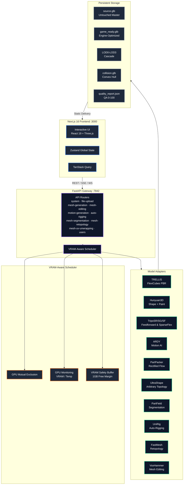
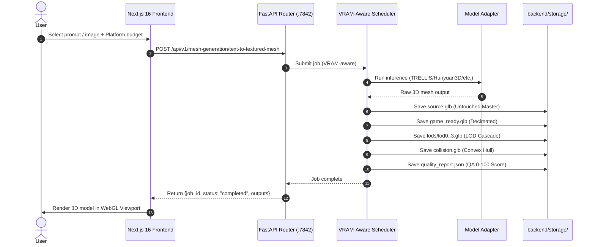
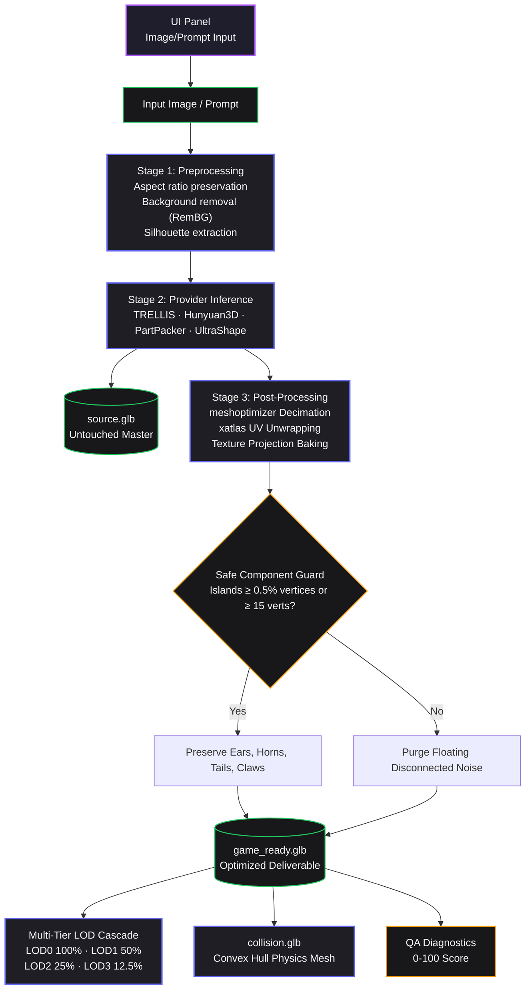
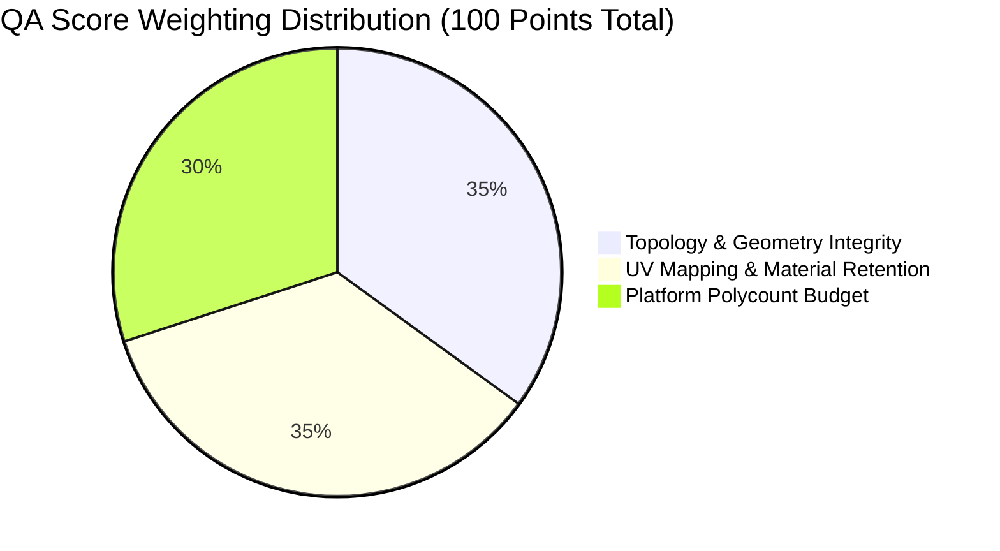

# Product Requirements Document — ForMash 3D

## Product

**ForMash 3D** — The premier open-source, self-hosted alternative to Tripo AI and Meshy for generative 3D asset creation, neural mesh synthesis, and automated game-ready post-processing.

## Problem & Market Positioning

Creating high-quality 3D assets requires expensive software, extensive artistic skill, and hours of manual work. Commercial cloud services (Tripo AI, Meshy, CSM) charge heavy recurring subscriptions, lock users into closed clouds, lack transparency, and force data uploads to third-party servers.

Existing open-source AI 3D tools produce raw outputs that lack the post-processing pipeline needed for game-ready assets (LOD cascades, physics colliders, quad retopology, UV unwrapping, QA validation).

**ForMash3D bridges this gap** by offering a 100% self-hosted, private studio running on your local NVIDIA GPU with 23 open-source neural model adapters and an automated game-engine finishing pipeline.

## Target Users

- Game developers needing rapid, production-ready 3D asset prototyping (Unreal Engine 5, Unity, Godot 4)
- 3D technical artists seeking local AI-assisted workflow acceleration
- Researchers experimenting with generative 3D shape, texture, and motion models
- Studios requiring offline, self-hosted 3D generation with absolute data privacy

## Goal

Create a centralized, local AI 3D asset factory that takes an image or text prompt and automatically produces the highest-quality practical 3D asset possible, preserves model-native geometry at an immutable `master/source.glb` checkpoint, processes it intelligently, validates it, optimizes it, and gives the user a usable game-ready result.

## Core Features

### 1. Neural Shape Generation
- **Image-to-3D**: Generate raw meshes from reference images using Hunyuan3D-Shape-v2-1, TRELLIS, TripoSR, TripoSG, TripoSF, PartPacker, UltraShape
- **Text-to-3D**: Generate meshes from text prompts using TRELLIS
- **Low-VRAM Path**: Hunyuan3D-DiT-v2-mini-Turbo for 6GB GPUs

### 2. PBR Texture Painting
- **Image Mesh Painting**: Paint textures onto existing meshes using Hunyuan3D-Paint-v2-1
- **RealESRGAN x4+**: Super-resolution for texture enhancement
- **DifferentiableRenderer**: PBR validation and material reference verification
- **Shape→Paint Auto-Chaining**: Automatic pipeline from shape generation to textured output
- **Configurable Parameters**: Texture resolution (512/768), max views (6-12), PBR state tracking

### 3. Post-Processing Pipeline
- **Mesh Decimation**: meshoptimizer SIMD decimation to target polycounts
- **UV Unwrapping**: xatlas conformal UV unwrapping
- **Texture Projection Baking**: Bake textures onto simplified meshes
- **Safe Component Guard**: Preserve anatomical features (≥0.5% vertices or ≥15 verts)

### 4. Multi-Tier LOD Generation
- LOD0 (100%), LOD1 (50%), LOD2 (25%), LOD3 (12.5%)
- UV and material preservation across LOD levels
- Platform-specific triangle budgets (Mobile ≤18K, Low ≤28K, Medium ≤45K, High ≤85K, Cinematic ≤180K)

### 5. Physics Colliders
- Convex hull collision geometry via Trimesh
- Watertight mesh validation

### 6. Objective QA Diagnostic Engine
- Composite 0–100 score
- Topology & Geometry Integrity (35 pts)
- UV Mapping & Material Retention (35 pts)
- Platform Polycount Budget (30 pts)
- Non-manifold edge detection, UV overlap analysis, component count

### 7. Modular Game-Ready Export
- One-click download of structured ZIP packages
- Formats: GLB, OBJ, STL, FBX
- Organized: Source/, GameReady/, LODs/, Collision/, QA/

### 8. Animation & Rigging
- **UniRig**: Automated bipedal skeletal armature generation
- **ARDY**: Interactive autoregressive text-to-motion generation
- Browser-playable `motion.json` format for Three.js

### 9. Mesh Segmentation
- **PartField**: Semantic part decomposition of 3D meshes
- **P3-SAM**: High-precision point prompt 3D SAM segmentation

### 10. Mesh Editing
- **VoxHammer**: Text/image-guided local neural mesh editing
- Localized deformation with prompt control

### 11. Retopology
- **FastMesh**: Fast neural retopology (V1K, V4K)
- Manifold cleanup and target face count control

### 12. UV Unwrapping
- **PartUV**: Automated seam placement and UV chart packing
- Part-based UV unwrapping with LSCM

## MVP

- Image-to-3D shape generation (Hunyuan3D-Shape-v2-1, TRELLIS)
- PBR texture painting (Hunyuan3D-Paint-v2-1)
- Post-processing pipeline (decimation, UV, LOD, collision)
- QA scoring (0–100)
- Game-ready export (ZIP package)
- Web UI with 3D viewport

## Out of Scope

- Mobile application
- Payment system
- AI chatbot
- Social features
- Cloud-based processing (local-only by default)
- Real-time multiplayer collaboration

## Success Criteria

A user should be able to:
1. Upload a reference image or enter a text prompt
2. Select a model and generation parameters
3. Receive a complete game-ready 3D asset with LODs, collision, and QA report
4. Download a structured ZIP package for engine integration
5. View the 3D model in an interactive viewport with lighting controls

## Platform Triangle Budgets

| Platform | Target Triangle Budget | Max Vertices | Draw Calls |
|---|---|---|---|
| Mobile | ≤ 18,000 | ~10,000 | 1–2 |
| Low | ≤ 28,000 | ~16,000 | 1–2 |
| Medium | ≤ 45,000 | ~25,000 | 1–3 |
| High | ≤ 85,000 | ~50,000 | 1–4 |
| Cinematic | ≤ 180,000 | ~100,000 | 1–5 |

## Technology Stack

- **Frontend**: Next.js 16, React 19, TypeScript, Tailwind CSS v4, Three.js, React Three Fiber
- **Backend**: FastAPI, Python 3.10, Pydantic V2
- **Scheduler**: VRAM-aware multiprocess scheduler
- **Queue**: Redis 7 (optional, multi-worker mode)
- **Package Manager**: Bun (frontend), Conda/uv (backend)
- **GPU**: NVIDIA CUDA 12.4, PyTorch 2.6.0

## Architecture



## Generation Request Flow



## Quality Pipeline



## VRAM Requirements by Model

| Model | VRAM Required | Quality | Speed |
|---|---|---|---|
| TRELLIS | 11.5 GB | High quality | ~60 seconds |
| TRELLIS.2 | 23 GB | Highest quality | ~60 seconds |
| Hunyuan3D-Shape-v2-1 | 10 GB (shape) / 29 GB (shape+texture) | High quality | ~90 seconds |
| Hunyuan3D-Paint-v2-1 | ~21 GB | PBR texture with RealESRGAN x4+ | ~120 seconds |
| Hunyuan3D-DiT-v2-mini-Turbo | ~6 GB | Low-resource shape | ~30 seconds |
| TripoSR | 6 GB | Ultra-fast raw mesh | ~2-5 seconds |
| TripoSG | 8 GB | High-fidelity image/scribble | ~10-20 seconds |
| ARDY | 8 GB | Motion AI & Animation | ~10-25 seconds |
| PartPacker | 10 GB | Fast | ~60 seconds |
| UltraShape | 26.6 GB | Highest fidelity | ~30 seconds |
| PartField | 4 GB | Segmentation | ~15 seconds |
| P3-SAM | 60 GB | High-precision segmentation | ~15 seconds |
| UniRig | 9 GB | Auto-rigging | ~20 seconds |
| FastMesh-V1K | 16 GB | Retopology | ~30 seconds |
| FastMesh-V4K | 24.5 GB | High-res retopology | ~30 seconds |
| VoxHammer | 40 GB | Mesh editing | ~20 seconds |

## QA Scoring Methodology



- **Topology & Geometry Integrity** (35 pts): Non-zero geometry, consistent normals, watertight manifoldness, connected component cleanliness
- **UV Mapping & Material Retention** (35 pts): Valid UVs, texture retention, UV overlap detection
- **Platform Polycount Budget** (30 pts): Target triangle budget compliance, LOD cascade correctness

## Third-Party Model Licenses

ForMash 3D does not own or claim rights to third-party architectures or weights. See `Docs/MODEL_LICENSES.md` for complete licensing information.

## Configuration

Key environment variables in `.env`:

```env
ENVIRONMENT=development
DEBUG=true
APP_NAME=ForMash 3D API
APP_VERSION=0.1.0
BACKEND_URL=http://localhost:7842
REDIS_URL=redis://localhost:6379/0
CUDA_DEVICE=auto
MAX_VRAM_MB=0
VRAM_SAFETY_MARGIN_MB=1024
AUTO_UNLOAD_AFTER_JOB=true
STORAGE_LOCAL_PATH=./backend/storage
API_V1_PREFIX=/api/v1
CORS_ORIGINS=["http://localhost:3000"]
P3D_USER_AUTH_ENABLED=false
```

## Access Points

| Service | URL | Port | Description |
|---|---|---|---|
| Frontend Workspace | `http://localhost:3000` | 3000 | Interactive generation and 3D viewport |
| Backend REST API | `http://localhost:7842` | 7842 | FastAPI application gateway |
| Interactive API Docs | `http://localhost:7842/docs` | 7842 | Swagger UI with test sandbox |
| Health Check | `http://localhost:7842/health` | 7842 | Service health status |

## Project Structure

```text
ForMash3D/
├── app/                               # Next.js 16 App Router
├── features/                          # Feature modules
├── components/                        # Shared UI components
├── hooks/                             # React hooks
├── services/                          # API clients
├── stores/                            # Zustand stores
├── backend/                           # FastAPI backend
│   ├── api/                           # Routers
│   ├── core/                          # Scheduler, VRAM manager
│   ├── adapters/                      # Model adapters
│   ├── config/                        # models.yaml, system.yaml
│   ├── scripts/                       # install.sh, download_models.sh
│   ├── thirdparty/                    # Third-party source code
├── scripts/                           # Setup and lifecycle scripts
├── docs/                              # Technical documentation
├── backend/storage/                   # Generated assets
├── backend/thirdparty/wheels/         # Prebuilt wheels
├── .env.example                       # Environment template
├── README.md
├── LICENSE
├── SECURITY.md
└── package.json
```

## Deployment Modes

### Single-Worker Mode
```bash
cd backend && conda activate 3daigc-api
uvicorn api.main_singleworker:app --workers 1 --port 7842
```

### Multi-Worker Mode (Redis Queue)
```bash
redis-server
conda activate 3daigc-api
python backend/scripts/scheduler_service.py
cd backend && conda activate 3daigc-api
uvicorn api.main_multiworker:app --workers 4 --port 7842
```

## Future Roadmap

- [ ] Cloudflare tunneling for remote access
- [ ] Automated test suite (backend e2e tests)
- [ ] DCC Bridge (Blender, Unreal, Unity, Maya)
- [ ] Advanced animation studio with timeline
- [ ] Model-specific fine-tuning UI
- [ ] Batch generation queue management
- [ ] Collaborative workspace features
- [ ] Mobile-responsive PWA support

## Current Production Post-Processing Contract — 2026-09-29

Every successful mesh-generation job automatically enters post-processing. The raw generation output is preserved byte-for-byte in backend/storage/models/<asset_name>_<job_hash>/master/source.glb before any destructive operation.

The canonical workspace contains master/, game_ready/, lods/, collision/, textures/, previews/, and metadata/. Only artifacts that actually succeed are written.

Normal downloads target game_ready/. ZIP export is an on-demand snapshot of the entire workspace.

## Physics capability
The product now supports an optional Physics Ready generation intent. Users can enable physics preparation before generation and adjust body behaviour, mass mode, collision quality, friction, restitution, damping, and gravity. Physics-ready assets expose collision and physics metadata and can be interactively tested in the existing model viewer. The first production scope is rigid-body simulation; deformable/jiggle behaviour remains capability-gated rather than being faked. Physics preparation reuses the existing collision pipeline and does not add an AI model.
