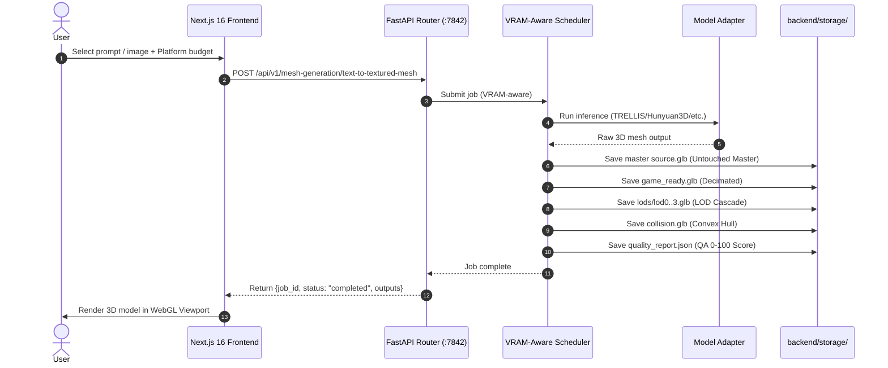

## 2026-09-30 Review Audit Runtime Contracts

- Redis control-plane data uses noeviction; result payloads use dedicated TTL keys.
- Scheduler SQLite persistence is offloaded from the async event loop.
- Processing jobs are recovered after backend restart.
- Timeout and cancellation terminate the owning worker before the job becomes terminal.
- Client filesystem paths are root-restricted and upload/base64 ingestion is bounded.
- Resource-blocked jobs rotate instead of globally blocking compatible work.

# 🏛️ ForMash 3D — Complete System Architecture & Pipeline Blueprint

> **System Version**: 0.1.0 (FastAPI + Next.js 16, Python 3.10)
> **Target Deployments**: Single-GPU Linux / Cloud GPU / Local Workstations
> **Last Verified**: September 2026
> **Design Tokens**: Studio Gold `#FFCC00` (`48 100% 50%`) on Matte Black `#080808`

---

## 1. Executive System Overview

ForMash 3D is an end-to-end generative 3D reconstruction and asset optimization platform that converts 2D images or text prompts into game-ready 3D assets (`.glb`, `.obj`, `.fbx`, `.stl`, PBR textures, LOD cascades, collision hulls).

### Core Stack
- **Frontend**: Next.js 16 (React 19, TypeScript, Three.js, React Three Fiber, Tailwind CSS)
- **API Gateway**: FastAPI (Python 3.10, Conda env `3daigc-api`, Pydantic V2, AsyncIO)
- **Model Adapters**: Python adapters for TRELLIS, Hunyuan3D-2.1, PartPacker, UltraShape, PartField, P3-SAM, UniRig, FastMesh, VoxHammer
- **Scheduler**: VRAM-aware multiprocess scheduler with GPU monitoring
- **Queue/Broker**: Redis 7 (optional, multi-worker mode only)
- **File Storage**: Local filesystem + Redis FileStore (multi-worker mode)

```mermaid
graph TD
    classDef client fill:#1e293b,stroke:#3b82f6,stroke-width:2px,color:#fff
    classDef gateway fill:#0f172a,stroke:#8b5cf6,stroke-width:2px,color:#fff
    classDef scheduler fill:#1e293b,stroke:#f97316,stroke-width:2px,color:#fff
    classDef adapters fill:#0f172a,stroke:#10b981,stroke-width:2px,color:#fff
    classDef storage fill:#1e293b,stroke:#ec4899,stroke-width:2px,color:#fff
    classDef queue fill:#0f172a,stroke:#f59e0b,stroke-width:2px,color:#fff

    subgraph Client["🌐 Next.js 16 Frontend :3000"]
        direction TB
        UI["React 19 + TypeScript + R3F"]:::client
        STATE["Zustand Global State"]:::client
        QUERY["TanStack Query"]:::client
    end

    subgraph Gateway["⚡ FastAPI Gateway :7842"]
        direction TB
        API["Routers: system, generation,<br/>editing, rigging, segmentation"]:::gateway
        SCHED["VRAM-Aware Scheduler"]:::scheduler
    end

    subgraph S["🎮 VRAM-Aware Scheduler"]
        direction TB
        GPU_LOCK["GPU Mutual Exclusion"]:::scheduler
        MONITOR["GPU Monitor<br/>VRAM / Temp"]:::scheduler
        SAFETY["VRAM Safety Buffer<br/>1GB Free Margin"]:::scheduler
        AUTO_UNLOAD["Auto-Unload After Job"]:::scheduler
    end

    subgraph Adapters["🧠 Model Adapters"]
        direction TB
        TRELLIS["TRELLIS<br/>FlexiCubes PBR"]:::adapters
        HUNY["Hunyuan3D<br/>Shape + Paint"]:::adapters
        TRIPO["TripoSR/SG/SF"]:::adapters
        PP["PartPacker"]:::adapters
        US["UltraShape"]:::adapters
        PF["PartField"]:::adapters
        UR["UniRig"]:::adapters
        FM["FastMesh"]:::adapters
        VH["VoxHammer"]:::adapters
    end

    subgraph Storage["💾 Persistent Storage"]
        direction TB
        LOCAL["Local Filesystem<br/>backend/storage/models/[job_id]/"]:::storage
        REDIS_STORE["Redis FileStore<br/>Cross-Worker Metadata"]:::storage
    end

    subgraph Queue["📦 Redis 7 :6379"]
        direction TB
        JOB_QUEUE["Job Queue<br/>(multi-worker)"]:::queue
    end

    Client -- "REST / SSE / WS" --> Gateway
    Gateway --> SCHED
    SCHED --> GPU_LOCK
    SCHED --> MONITOR
    SCHED --> SAFETY
    SCHED --> AUTO_UNLOAD
    SCHED --> Adapters
    Adapters -->|Raw Mesh| Storage
    Storage -- "Static Delivery" --> Client
    Gateway -.->|Job Queue| Queue

    style Client fill:#1e293b
    style Gateway fill:#0f172a
    style S fill:#1e293b
    style Adapters fill:#0f172a
    style Storage fill:#0f172a
    style Queue fill:#0f172a
```



---

## 2. End-to-End Generation Lifecycle



---

## 3. Paint-v2-1 Pipeline Flow

```mermaid
flowchart TD
    classDef input fill:#1e293b,stroke:#3b82f6,stroke-width:2px,color:#fff
    classDef process fill:#0f172a,stroke:#10b981,stroke-width:2px,color:#fff
    classDef output fill:#1e293b,stroke:#ec4899,stroke-width:2px,color:#fff
    classDef guard fill:#0f172a,stroke:#f59e0b,stroke-width:2px,color:#fff

    IN["📥 Input: source.glb<br/>Untouched Master Mesh"]:::input
    IN --> SHAPE["🔧 Stage 1: Shape Generation<br/>Hunyuan3D-Shape-v2-1"]:::process
    SHAPE --> MESH["🧱 Raw Mesh Output"]:::output
    MESH --> PAINT["🎨 Stage 2: Paint Pipeline<br/>hunyuan3d_paint_v21_image_mesh_painting"]:::process
    PAINT --> RES["🔍 RealESRGAN x4+<br/>Super-Resolution"]:::process
    RES --> PBR["📐 DifferentiableRenderer<br/>PBR Validation"]:::process
    PBR --> VRAM{"⚡ VRAM Check<br/>~21GB Required?"}:::guard
    VRAM -->|✅ Yes| OK["✅ PBR Texture Ready<br/>texture.glb"]:::output
    VRAM -->|⚠️ No| LOW["⚠️ Reduce Views<br/>or Resolution"]:::guard
    OK --> CONFIG["⚙️ Configurable Parameters<br/>Resolution: 512/768<br/>Max Views: 6-12<br/>PBR State: Tracked"]:::process
    CONFIG --> EXPORT["📦 Export: texture.glb<br/>PBR Materials"]:::output

    style IN fill:#1e293b
    style SHAPE fill:#0f172a
    style PAINT fill:#0f172a
    style RES fill:#0f172a
    style PBR fill:#0f172a
    style VRAM fill:#0f172a
    style OK fill:#1e293b
    style EXPORT fill:#1e293b
```



---

## 4. High-Throughput & Low-Latency Performance Architecture

### 4.1 VRAM-Aware Scheduling

| Optimization | Mechanism | Impact |
|---|---|---|
| **GPU Mutual Exclusion** | Strict locking prevents multi-provider GPU OOM | Safe concurrent inference |
| **GPU Monitoring** | Real-time VRAM/temperature polling via `GPUMonitor` | Dynamic scheduling decisions |
| **VRAM Safety Buffer** | `memory_buffer=1024` (1GB free) + `VRAM_SAFETY_MARGIN_MB=1024` | Prevents OOM on loaded models |
| **Auto Unload** | `AUTO_UNLOAD_AFTER_JOB=true` | Frees VRAM between jobs |

### 4.2 API Performance

| Optimization | Mechanism | Impact |
|---|---|---|
| **Request Timing** | `X-Process-Time` response header on every request | Latency visibility |
| **Connection Reuse** | Frontend uses axios singleton (`services/apiClient.ts`) | Eliminates per-request overhead |
| **SSE Streaming** | Server-Sent Events for generation progress | Real-time feedback without polling |
| **ORJSON Serialization** | `ORJSONResponse` with graceful fallback | 10-20x faster JSON |
| **GZip Compression** | `GZipMiddleware(minimum_size=1000)` | 75-85% response size reduction |

### 4.3 VRAM Requirements by Model

| Model | VRAM Required | Quality | Speed |
|---|---|---|---|
| TRELLIS | 11.5 GB | High quality | ~60 seconds |
| TRELLIS.2 | 23 GB | Highest quality | ~60 seconds |
| Hunyuan3D-Shape-v2-1 | 10 GB (shape) / 29 GB (shape+texture) | High quality | ~90 seconds |
| Hunyuan3D-Paint-v2-1 | ~21 GB | PBR texture with RealESRGAN x4+ | ~120 seconds |
| Hunyuan3D-DiT-v2-mini-Turbo | ~6 GB | Low-resource shape | ~30 seconds |
| TripoSR | 6 GB | Ultra-fast raw mesh | ~2-5 seconds |
| TripoSG | 8 GB | High-fidelity image/scribble | ~10-20 seconds |
| ARDY | 8 GB | Motion AI & Animation | ~10-25 seconds |
| PartPacker | 10 GB | Fast | ~60 seconds |
| UltraShape | 26.6 GB | Highest fidelity | ~30 seconds |
| PartField | 4 GB | Segmentation | ~15 seconds |
| P3-SAM | 60 GB | High-precision segmentation | ~15 seconds |
| UniRig | 9 GB | Auto-rigging | ~20 seconds |
| FastMesh-V1K | 16 GB | Retopology | ~30 seconds |
| FastMesh-V4K | 24.5 GB | High-res retopology | ~30 seconds |
| VoxHammer | 40 GB | Mesh editing | ~20 seconds |

---

## 5. Multi-Format Asset Packaging & Delivery

Generated assets are packaged for delivery via the API. The following formats are supported for export:

| Format | Target Software / Engine | PBR Support |
|---|---|---|
| **GLB** | WebGL, Three.js, Godot 4 | Complete PBR (Roughness/Metallic) |
| **GLTF** | WebGL, Three.js | Complete PBR |
| **FBX** | Unreal Engine 5, Unity | Skeletal Rig + Materials |
| **OBJ** | Wavefront, ZBrush | Geometry + MTL |
| **STL** | 3D Printing, CAD | Pure Surface Geometry |
| **PLY** | Point Clouds, MeshLab | Vertex Coordinates & Colors |

Production ZIP bundles:
```
Project_Export_<job_id>.zip
├── Source/
│   └── source.glb              # Original byte-for-byte neural output
├── GameReady/
│   └── game_ready.glb          # Engine-compliant decimated mesh
├── LODs/
│   ├── lod0.glb                # 100% triangles (Master baseline)
│   ├── lod1.glb                # 50% triangles (Mid distance)
│   ├── lod2.glb                # 25% triangles (Long distance)
│   └── lod3.glb                # 12.5% triangles (Proxy geometry)
├── Collision/
│   └── collision.glb           # Watertight physics convex hull
└── QA/
    └── quality_report.json     # Topology validation score (0-100)
```

> **Note**: Asset delivery uses GET /api/v1/system/jobs/{job_id}/download?artifact_format=.... ZIP archives are generated on demand from the canonical asset workspace.

---

## 6. Deployment Modes

### Single-Worker (Default)

```bash
cd backend && conda activate 3daigc-api
uvicorn api.main_singleworker:app --workers 1 --port 7842
```

- Embedded VRAM-aware scheduler
- No external broker required
- Best for single-GPU and CPU deployments

### Multi-Worker (Redis Queue)

```bash
# Terminal 1: Start Redis
redis-server

# Terminal 2: Start scheduler service
conda activate 3daigc-api
python backend/scripts/scheduler_service.py

# Terminal 3: Start API workers
cd backend && conda activate 3daigc-api
uvicorn api.main_multiworker:app --workers 4 --port 7842
```

- Redis-backed job queue (`RedisJobQueue`)
- Multiple uvicorn workers
- Redis FileStore for cross-worker metadata sharing
- Optional Redis-based authentication (`P3D_USER_AUTH_ENABLED=true`)

---

## 7. Verification & Health Check

The backend exposes a health endpoint for runtime verification:
```bash
curl -s http://localhost:7842/health | jq .
# {"status": "healthy", "timestamp": ..., "version": "0.1.0"}
```

The frontend can be type-checked and built with:
```bash
npx tsc --noEmit
bun run build
```

> **Note**: An automated `backend/tests/test_backend_e2e.py` test script referenced in earlier documentation does not currently exist. The health endpoint and TypeScript compiler provide the available self-check mechanisms.

## Production Asset Lifecycle — Current

Generation -> master/source.glb -> repair/optimize/Auto UV/bake -> game_ready/* -> LOD/collision/textures/previews/metadata -> existing job status UI -> protected artifact download.

The post-processing stage runs in asyncio.to_thread so CPU-heavy mesh operations do not block FastAPI's event loop.

## Physics path
Generation requests may carry a physics intent and provider-neutral controller values. The scheduler preserves those values as job metadata. Post-processing conditionally reuses the existing collision service and writes `metadata/physics.json`. The viewer consumes the canonical collision artifact and metadata through a pinned Rapier 0.19.3 browser adapter while the existing Three.js rendering pipeline remains unchanged. Physics binding waits for asset-load completion to prevent cross-asset state leakage.

## Review Audit — Current Job Lifecycle

Browser JobStore / Workspace jobs → FastAPI submit → scheduler → GPU worker → **raw result ready** → completed job becomes user-visible → background postprocess → canonical master/game-ready artifacts.

Batch submissions use a scheduler-owned batch identifier and `max_parallel`; blocked batch items remain queued without consuming another worker slot.

## Review Audit Final Runtime Flow

Browser → versioned API → canonical model/capability readiness → scheduler/resource reservation → worker → raw result visible → background post-processing → canonical asset manifest → QA/game-ready/export artifacts.

Batch jobs share one batch ID but retain independent job IDs. Cancellation is centralized through the scheduler control plane, including Redis deployments.


## 2026-09-30 Final Runtime Contract Reconciliation

- Container dependency paths resolve against the repository's backend layout and the maintained Wheels release.
- SQLite status/progress persistence is offloaded and bounded; status reads do not mutate or synchronously persist jobs.
- Successful raw inference is terminal for GPU execution; background production post-processing carries independent status/progress/error metadata and preserves input lineage until completion.
- Model readiness is based on canonical manifest paths, real local checkpoint payloads, CUDA availability, capabilities, and manifest VRAM; adapter defaults do not override that contract.
- The workspace uses backend capability metadata for route selection, keeps unsupported multiview gated, maintains bounded LRU GLB cache accounting, and rehydrates final production artifacts into the same job asset.
- Artifact naming is UUID-based across generation/segmentation/rig outputs, and stale request temp directories are removed during scheduler recovery.
