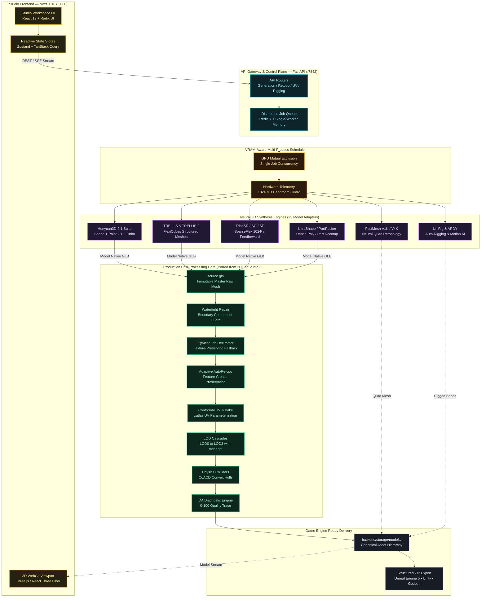

<!-- ===================== HERO BANNER ===================== -->

<p align="center">
  
</p>

<h1 align="center">
    ForMash3D
</h1>

<p align="center">
  <strong>Open-Source Generative 3D Mesh Studio & Production Pipeline</strong><br>
  <em>A unified, self-hosted 3D creation suite inspired by modern neural platforms like Tripo AI and Meshy</em><br>
  Text-to-3D • Image-to-3D • Quad Retopology • PBR Material Painting • Auto-Rigging • Automated LODs • Game Engine Ready
</p>

<p align="center">
  <a href="https://github.com/Silentzx2/ForMash3D"></a>
  <a href="https://github.com/Silentzx2/ForMash3D"></a>
  <a href="https://github.com/Silentzx2/ForMash3D"></a>
  <a href="https://github.com/Silentzx2/ForMash3D"></a>
  <a href="https://github.com/Silentzx2/ForMash3D"></a>
  <a href="https://github.com/Silentzx2/ForMash3D"></a>
  <a href="LICENSE"></a>
</p>

<p align="center">
  <strong>⚡ Quick Start:</strong> <code>git clone https://github.com/Silentzx2/ForMash3D.git</code> → <code>bun install</code> → <code>bash scripts/start.sh</code> → Open <a href="http://localhost:3000">http://localhost:3000</a>
</p>

---

## 🌟 Overview & Product Vision

**ForMash3D** is an open-source, self-hosted generative 3D asset creation and mesh-finishing platform. It bridges modern state-of-the-art open research models into a single, cohesive studio running entirely on your local workstation or private GPU cluster.

Inspired by the intuitive user workflows of modern commercial platforms such as **Tripo AI** and **Meshy**, ForMash3D gives 3D technical artists, indie game developers, and researchers complete freedom:
- **100% Private & Self-Hosted**: Run generation locally on NVIDIA GPUs without subscriptions, cloud queues, or uploading proprietary concept art to external servers.
- **Zero Loss Quality Guarantee**: Model-native generation is preserved immutably at `master/source.glb` before any optimization or decimation.
- **Production Asset Finishing**: Features a complete post-processing pipeline forked and customized from **[3DGenStudio](https://github.com/visualbruno/3DGenStudio)**, delivering watertight repair, conformal UV unwrapping, PBR material baking, quad retopology, multi-tier LOD cascades, and CoACD convex physics collision hulls.

---

> [!WARNING]
> ### ⚖️ Licensing, Commercial & SaaS Advisory (Important)
>
> 1. **Core Repository License**: ForMash3D's original code (orchestrator, API gateway, scheduler, and Next.js studio UI) is open-source under the **[Apache License 2.0](LICENSE)**.
> 2. **Post-Processing Provenance**: The mesh post-processing engine (`backend/postprocess/`) was forked and customized from **[visualbruno/3DGenStudio](https://github.com/visualbruno/3DGenStudio)** under the **3D Gen Studio Community License**. See **[backend/postprocess/THIRD_PARTY_LICENSE.md](backend/postprocess/THIRD_PARTY_LICENSE.md)**.
> 3. **Commercial Ownership of Outputs**: **You own 100% of the 3D meshes, textures, rigs, and assets generated with ForMash3D**. You are completely free to use, monetize, sell, or include them in commercial games and software without restrictions.
> 4. **Notice for Commercial & SaaS Implementors**:
>    - The Apache 2.0 license applies **strictly to ForMash3D's original code**. We do **not** own or re-license the underlying third-party models, research weights, or ported submodules.
>    - The ported `3DGenStudio` post-processing pipeline prohibits hosting the software as a paid public/private commercial SaaS service without explicit written consent from the upstream author (`visualbruno`).
>    - Individual model checkpoints (e.g. Hunyuan3D-2.1, FastMesh, UltraShape, TripoSF) carry their own respective upstream research, academic, or non-commercial licenses (see **[backend/thirdparty/LICENSE](backend/thirdparty/LICENSE)** and individual `backend/thirdparty/<model>/LICENSE` files).
>    - **Do NOT blindly deploy or redistribute ForMash3D as a paid commercial product or SaaS** without auditing and complying with the respective licenses of each integrated model and component!

> [!NOTE]
> ### 🛡️ Repository Rules & Engineering Standards
> All contributions and architectural modifications must comply strictly with **[RULES.md](RULES.md)**:
> - **Ponytail Minimalist Architecture**: YAGNI-first, reuse existing helpers and standard library, shortest correct diffs, zero speculative abstractions.
> - **Documentation Integrity**: Any pipeline or backend modification must be reflected across all `Docs/*.md` guides immediately.
> - **Source Integrity**: Downstream post-processing must operate on derived data and never mutate `master/source.glb`.

---

## 📊 Workflow & Capability Comparison

A technical comparison of ForMash3D versus commercial cloud platforms:

| Capability | **ForMash3D (This Studio)** | **Tripo AI (Cloud)** | **Meshy AI (Cloud)** | **CSM (Cloud)** |
|---|:---:|:---:|:---:|:---:|
| **Pricing** | **100% Free & Open-Source (Apache 2.0)** | $20 – $100+/mo | $20 – $80/mo | $30 – $120/mo |
| **Hosting & Privacy** | **100% Private (Local NVIDIA GPU)** | Proprietary Cloud | Proprietary Cloud | Proprietary Cloud |
| **Model Diversity** | **23 Pluggable Open-Source Adapters** | 1 Proprietary Model | 1 Proprietary Model | 1 Proprietary Model |
| **Raw Geometry Preservation** | **Yes (`master/source.glb` preserved)** | ❌ Aggressive cloud decimation | ❌ Cloud compressed | ❌ Cloud compressed |
| **Quad Retopology** | **FastMesh (V1K/V4K) & AutoRetopo** | Basic remesh | Basic remesh | Paid add-on |
| **Progressive LODs** | **LOD0 to LOD3 with UV preservation** | ❌ Single level | Paid add-on | ❌ Single level |
| **PBR Texture Painting** | **Hunyuan3D-Paint-v2.1 (2B) + SuperRes** | Cloud standard | Cloud standard | Cloud standard |
| **Physics Colliders** | **CoACD Convex Hulls + Rapier3D Wasm** | ❌ None | ❌ None | ❌ None |
| **Rigging & Motion** | **UniRig (Bipedal) + ARDY (Motion AI)** | Basic auto-rig | Extra credit cost | ❌ None |
| **Engine Ready Export** | **Unreal Engine 5, Unity, Godot 4, Blender** | Basic GLB | Basic GLB | Basic GLB |

---

## 🔄 End-to-End Asset Generation Pipeline

ForMash3D enforces an **immutable master preservation architecture**. The raw neural model output is immediately snapshotted at `master/source.glb` before any downstream finishing operations, guaranteeing zero accidental loss of fine surface detail:

```text
  INPUT                     NEURAL GENERATION               CANONICAL CHECKPOINT
┌─────────────────────┐    ┌───────────────────────────┐    ┌──────────────────────────┐
│  • Text Prompt      │───►│  23 Neural Adapters:      │───►│ master/source.glb        │
│  • Single Image     │    │  TRELLIS / Hunyuan3D 2.1  │    │ (Immutable Master Mesh)  │
│  • Multi-View Image │    │  TripoSR / TripoSG / SF   │    │ Preserves Raw Topology   │
└─────────────────────┘    └───────────────────────────┘    └────────────┬─────────────┘
                                                                         │
 ┌───────────────────────────────────────────────────────────────────────┘
 │  PRODUCTION POST-PROCESSING & ENGINE FINISHING (Ported & Enhanced from 3DGenStudio)
 ▼
┌─────────────────┐    ┌─────────────────┐    ┌─────────────────┐    ┌─────────────────┐
│ 1. Repair       │───►│ 2. Retopo       │───►│ 3. UV & Bake    │───►│ 4. LOD Cascade  │
│ Watertightness  │    │ FastMesh Quads  │    │ Conformal UV    │    │ LOD0: 100%      │
│ Non-Manifold Fix│    │ AutoRetopo Def. │    │ PBR Material Map│    │ LOD1: 50%       │
│ Boundary Guard  │    │ Feature Angle   │    │ RealESRGAN x4+  │    │ LOD2: 25% / 12% │
└─────────────────┘    └─────────────────┘    └─────────────────┘    └────────┬────────┘
                                                                              │
 ┌────────────────────────────────────────────────────────────────────────────┘
 ▼
┌─────────────────┐    ┌─────────────────┐    ┌────────────────────────────────────────┐
│ 5. Physics      │───►│ 6. QA Engine    │───►│ GAME-READY EXPORT PACKAGE              │
│ CoACD Convex    │    │ 0-100 Score     │    │ • game_ready.glb (Unreal / Unity/Godot)│
│ Decomposition   │    │ Stage Snapshots │    │ • lods/ (lod0.glb - lod3.glb)          │
│ Rapier3D WebSim │    │ Quality Trace   │    │ • collision.glb & physics.json         │
└─────────────────┘    └─────────────────┘    │ • Structured Engine-Ready ZIP Archive  │
                                              └────────────────────────────────────────┘
```

---

## 🏗️ System Architecture

The following diagram illustrates the multi-tier system architecture connecting the Next.js studio frontend, FastAPI control plane, VRAM scheduler, neural adapters, and post-processing pipeline:



---

## 🤖 Supported Model Catalog (23 Models)

The model registry is dynamically configured via `backend/config/models.yaml` and loaded lazily:

| Model Architecture | Registered Model ID | Category / Task | VRAM Budget | Key Technical Capabilities |
|---|---|---|:---:|---|
| **Hunyuan3D-Shape-v2.1** | `hunyuan3d_shape_v21_image_to_raw_mesh` | Raw Mesh | ~10 GB | 3.3B shape model, official 2.1 pipeline, octree resolution up to 512 |
| **Hunyuan3D-Paint-v2.1** | `hunyuan3d_paint_v21_image_mesh_painting` | PBR Texture | ~21 GB | 2B PBR texture checkpoint, RealESRGAN x4+, DifferentiableRenderer |
| **Hunyuan3D-DiT-v2-mini-Turbo** | `hunyuan3d_dit_v2_mini_turbo_image_to_raw_mesh` | Raw Mesh | ~6 GB | 0.6B low-VRAM step-distilled shape model with Turbo path |
| **TRELLIS** | `trellis_image_to_textured_mesh`<br>`trellis_text_to_textured_mesh` | Text/Image to Mesh | 11.5 GB | FlexiCubes PBR meshes with 2048x2048 texture maps |
| **TRELLIS.2** | `trellis2_image_to_textured_mesh`<br>`trellis2_image_mesh_painting` | Structured 3D & Paint | 23.5 GB | High-fidelity FlexiCubes with multi-view PBR texture baking |
| **TripoSR** | `triposr_image_to_raw_mesh` | Single-Image to 3D | 6 GB | Ultra-fast feedforward 3D reconstruction with texture baking |
| **TripoSG** | `triposg_image_to_raw_mesh` | Image/Scribble to 3D | 8 GB | High-fidelity image and scribble guided 3D geometry |
| **TripoSF** | `triposf_image_to_raw_mesh` | SparseFlex Mesh | 12 GB | High-resolution arbitrary-topology modeling with SparseFlex VAE |
| **FastMesh (1K & 4K)** | `fastmesh_v1k_retopology`<br>`fastmesh_v4k_retopology` | Mesh Retopology | 16–24.5 GB | Fixed-budget neural quad retopology producing clean animation loops |
| **PartPacker** | `partpacker_image_to_raw_mesh` | Part-Level 3D | 10 GB | Rectified-flow multi-part geometric decomposition |
| **UltraShape** | `ultrashape_image_to_raw_mesh` | Dense Mesh | 26.6 GB | Dense surface reconstruction via cubvh |
| **PartField** | `partfield_mesh_segmentation` | Mesh Segmentation | 4 GB | Semantic part decomposition of 3D meshes |
| **P3-SAM** | `p3sam_mesh_segmentation` | Precision SAM | 60 GB | High-precision point prompt 3D SAM segmentation |
| **UniRig** | `unirig_auto_rig` | Auto-Rigging | 9 GB | Automated bipedal skeletal armature generation |
| **ARDY** | `ardy_motion_generation` | Motion AI | 8 GB | Interactive autoregressive text-to-motion generation |
| **PartUV** | `partuv_uv_unwrapping` | UV Unwrapping | 7 GB | Automated seam placement and UV chart packing |
| **VoxHammer** | `voxhammer_text_mesh_editing`<br>`voxhammer_image_mesh_editing` | Mesh Editing | 40 GB | Voxel-guided localized neural mesh deformation |

---

## ⚙️ Production Post-Processing Engine

Raw AI generative meshes typically suffer from non-manifold triangles, missing UV layouts, dense topological noise, and absence of physics colliders. ForMash3D's post-processing engine (ported and enhanced from [3DGenStudio](https://github.com/visualbruno/3DGenStudio)) automates asset finishing:

```text
backend/storage/models/<asset_name>_<job_hash>/
├── master/
│   └── source.glb              # Immutable master raw mesh
├── game_ready/
│   └── <asset_name>.glb        # Production engine-ready model
├── lods/
│   ├── lod0.glb                # LOD0 (100% detail)
│   ├── lod1.glb                # LOD1 (50% reduction)
│   ├── lod2.glb                # LOD2 (25% reduction)
│   └── lod3.glb                # LOD3 (12.5% reduction)
├── collision/
│   └── collision.glb           # Watertight CoACD convex hull
├── textures/                   # PBR texture maps (Albedo, Normal, Roughness, Metallic, AO)
├── previews/                   # Rendered thumbnail images
└── metadata/
    ├── asset.json              # Canonical asset manifest
    ├── quality_report.json     # QA 0-100 score & stage trace
    └── physics.json            # Mass, center of mass, inertia tensor
```

### Core Finishing Highlights:
1. **Texture-Preserving Decimation**: Powered by PyMeshLab with custom wedge UV remapping. If complex non-manifold geometry prevents decimation, the engine safely falls back to passthrough without dropping materials.
2. **Structural AutoRetopo**: Triggers on structural boundary defects (e.g. boundary component holes > 30 edges) with feature-angle preservation (`25.0°`) and controlled smoothing.
3. **CoACD Physics Colliders**: Computes approximate convex decomposition for immediate rigid-body physics in game engines.
4. **Three.js & Rapier3D In-Browser Simulator**: Test gravity, bouncy collisions, and mass properties directly in the workspace viewer before exporting.

---

## 🛠️ Technology Stack

| Component | Technology | Rationale |
|---|---|---|
| **Frontend Framework** | **Next.js 16** (App Router), React 19, TypeScript | Server Components, fast client routing, static optimization |
| **UI Design System** | Tailwind CSS v4, Radix UI, Lucide Icons | Studio Gold dark theme (`hsl(48, 100%, 50%)`), accessible, responsive |
| **State & Query** | Zustand, TanStack Query | Reactive real-time stores and optimistic server-state sync |
| **3D Rendering** | Three.js, React Three Fiber | Real-time PBR shaders, wireframe inspection, matcaps |
| **Physics Preview** | `@dimforge/rapier3d-compat` (WebAssembly) | Fast browser physics simulation without external dependencies |
| **Backend API** | **FastAPI**, Python 3.10, Pydantic V2 | Async high-throughput REST, SSE event streaming |
| **GPU Scheduling** | Multiprocess VRAM Scheduler, Redis 7 Queue | Mutual exclusion, 1GB headroom buffer, memory safety |
| **Geometry Core** | PyMeshLab, Trimesh, CoACD, meshoptimizer | Watertight repair, quad retopo, texture decimation |
| **Package Managers** | Bun (Frontend), Conda (Python 3.10 `3daigc-api`) | Ultra-fast JS bundling and deterministic CUDA C++ bindings |

---

## 📦 Installation & Quick Start

### Prerequisites
- **OS**: Linux (Ubuntu 20.04, 22.04, or 24.04 recommended) or Windows WSL2.
- **GPU**: NVIDIA GPU with CUDA 12.4+ (minimum 8GB VRAM for basic models, 16GB–24GB+ recommended).
- **Node Environment**: [Bun](https://bun.sh/) installed.
- **Python**: Python 3.10 via Conda (`conda create -n 3daigc-api python=3.10`).

### 1. Clone & Frontend Setup

```bash
git clone https://github.com/Silentzx2/ForMash3D.git
cd ForMash3D

# Install frontend dependencies with Bun
bun install
```

### 2. Backend Environment & Setup

```bash
# Automated setup prepares the environment, builds C++/CUDA kernels,
# and installs backend dependencies
bash scripts/setup.sh
```

### 3. Model Weights & Checkpoints

Download pre-trained weights for the models you wish to use:

```bash
# Download model checkpoints (Hunyuan3D, TRELLIS, TripoSR, etc.)
bash backend/scripts/download_models.sh
```

### 4. Running the Studio

```bash
# Launch both backend (Port 7842) and Next.js frontend (Port 3000)
bash scripts/start.sh
```

Open **`http://localhost:3000`** in your browser.

Services:
- Frontend Studio: `http://localhost:3000`
- Backend API: `http://localhost:7842`
- Interactive Swagger Docs: `http://localhost:7842/docs`
- Health Endpoint: `http://localhost:7842/health`

---

## 🎮 Studio Workspace Modules

The ForMash3D workspace provides a comprehensive suite of creative 3D tools:

- **Generate Studio (`/workspace`)**: Text-to-3D and Image-to-3D generation with model selector, VRAM estimator, and step configuration.
- **Texture Studio (`/workspace/texture`)**: Multi-view PBR texture painting, Real-ESRGAN upscaling, and map baking (Albedo, Normal, Roughness, Metallic, AO).
- **Retopology & Remesh (`/workspace/remesh`)**: FastMesh quad-dominant retopology with V1K and V4K target presets.
- **UV Unwrapping (`/workspace/uv`)**: Automated conformal seam placement and atlas chart packing.
- **Mesh Segmentation (`/workspace/segment`)**: Semantic part decomposition via PartField and P3-SAM.
- **Mesh Editing (`/workspace/edit`)**: Localized text/image-driven neural mesh editing with VoxHammer.
- **Animation & Motion (`/animation`)**: UniRig bipedal armature generation and ARDY motion synthesis.
- **Jobs & Run Inspector (`/workspace/jobs`)**: Real-time progress tracking, step telemetry, and VRAM monitoring.
- **Admin & Model Registry (`/admin?tab=models`)**: Live GPU health, temperature, and adapter configuration.

---

## 🔌 API Endpoints Reference

The FastAPI backend exposes comprehensive REST and SSE streaming endpoints:

| Endpoint | Method | Description |
|---|:---:|---|
| `/api/v1/system/info` | `GET` | System health, GPU specs, VRAM utilization, active worker mode |
| `/api/v1/system/models` | `GET` | List all discovered 23 model adapters, readiness, and VRAM requirements |
| `/api/v1/mesh-generation/text-to-textured-mesh` | `POST` | Generate textured 3D mesh from descriptive text prompt |
| `/api/v1/mesh-generation/image-to-raw-mesh` | `POST` | Generate high-fidelity raw geometry from single reference image |
| `/api/v1/mesh-generation/image-to-textured-mesh` | `POST` | Generate textured geometry directly from image |
| `/api/v1/mesh-generation/image-mesh-painting` | `POST` | Paint PBR textures onto existing 3D geometry |
| `/api/v1/mesh-retopology/retopology` | `POST` | Run FastMesh V1K/V4K quad retopology on mesh |
| `/api/v1/mesh-uv-unwrapping/uv-unwrap` | `POST` | Generate conformal UV atlas charts |
| `/api/v1/mesh-segmentation/segment` | `POST` | Segment mesh into semantic parts |
| `/api/v1/mesh-editing/edit` | `POST` | Edit existing mesh using localized prompt deformation |
| `/api/v1/auto-rigging/rig` | `POST` | Generate bipedal skeleton armature |
| `/api/v1/motion-generation/generate` | `POST` | Synthesize motion sequence into playable JSON |
| `/api/v1/jobs/{job_id}/stream` | `GET` | SSE real-time progress and telemetry event stream |

---

## 🛠️ Verification & Test Suite

ForMash3D maintains rigorous unit, integration, and regression test suites:

```bash
# Run all backend unit & regression tests
FORMASH_POSTPROCESS_E2E=1 PYTHONPATH=backend pytest backend/tests/ -v

# Verify clean compilation across all Python modules
python3 -m compileall -q backend/

# Run frontend type and lint checks
npx tsc --noEmit
bun run lint

# Verify shell script syntax
bash -n backend/scripts/*.sh scripts/*.sh
```

**Verification Status**: **25 passed, 1 skipped** (Blender smoke test skipped cleanly when blender is absent).

---

## 🔍 Frequently Asked Questions (FAQ)

<details>
<summary><strong>How is ForMash3D inspired by platforms like Tripo AI and Meshy?</strong></summary>

ForMash3D draws workflow ergonomics inspiration from modern AI 3D platforms like **Tripo AI** and **Meshy**. It enables creators and game developers to go seamlessly from a single text prompt or reference photo to a fully textured, quad-retopologized, game-ready 3D model. However, unlike cloud platforms that charge recurring subscriptions and process meshes on remote servers, ForMash3D runs entirely on your local GPU, preserving complete data privacy, raw geometric fidelity, and open customization.
</details>

<details>
<summary><strong>Can I use ForMash3D commercially or deploy it as a paid SaaS service?</strong></summary>

**For Outputs**: Yes! You own 100% of all 3D meshes, textures, rigs, and assets generated with ForMash3D. You may use them in commercial video games, 3D printing, VFX, or digital storefronts.

**For Code & Hosting**: While ForMash3D's original orchestrator is open-source under Apache 2.0, the codebase incorporates ported engines (such as the `3DGenStudio` post-processing pipeline under the 3D Gen Studio Community License) and external neural model weights that carry non-commercial or academic research restrictions. **You may NOT sell the unmodified software or host it as a paid commercial SaaS service without explicit author permission.** Please review **[backend/thirdparty/LICENSE](backend/thirdparty/LICENSE)** and **[backend/postprocess/THIRD_PARTY_LICENSE.md](backend/postprocess/THIRD_PARTY_LICENSE.md)** for details.
</details>

<details>
<summary><strong>Can I generate clean quad-topology meshes for game animation?</strong></summary>

Yes. ForMash3D natively integrates **FastMesh** (V1K for rapid prop prototyping and V4K for hero characters) alongside an adaptive **AutoRetopo** pipeline. Unlike raw generative outputs that yield messy triangle soups, ForMash3D outputs clean quad-dominant edge loops with preserved feature creases, ready for skeletal auto-rigging and subdivision.
</details>

<details>
<summary><strong>How does ForMash3D handle PBR texturing and baking?</strong></summary>

ForMash3D features **Hunyuan3D-Paint-v2.1**, a 2B parameter diffusion checkpoint that projects multi-view high-resolution textures onto 3D geometry with automated **Real-ESRGAN x4+** super-resolution. The engine bakes complete PBR material channels (Albedo, Tangent Normal, Roughness, Metallic, and Ambient Occlusion) onto clean conformal UV layouts.
</details>

<details>
<summary><strong>Can ForMash3D run 100% offline without internet?</strong></summary>

Yes. Once your model checkpoints are downloaded via `bash backend/scripts/download_models.sh`, ForMash3D operates **completely offline**. No telemetry, prompts, reference images, or generated models are ever transmitted to any external server, ensuring complete data privacy and NDA compliance for commercial game studios.
</details>

<details>
<summary><strong>What GPU hardware is required to run ForMash3D?</strong></summary>

ForMash3D runs on modern NVIDIA GPUs supporting CUDA 12.4+:
- **Lightweight Models (6GB–10GB VRAM)**: TripoSR, TripoSG, Hunyuan3D-DiT-v2-mini-Turbo, PartField (runs comfortably on RTX 3060, 4060, RTX 2080).
- **Standard Models (12GB–16GB VRAM)**: TRELLIS, FastMesh, TripoSF SparseFlex (runs on RTX 3080, 4070, 4080, T4, L4).
- **Heavy & High-Poly Models (24GB+ VRAM)**: TRELLIS.2, Hunyuan3D-Paint 2B, UltraShape (runs on RTX 3090, 4090, A10, A100).
</details>

<details>
<summary><strong>What file formats can ForMash3D export for game engines?</strong></summary>

ForMash3D exports standard **GLB / glTF 2.0**, **OBJ**, **STL**, and **FBX** (via isolated Blender automation). Downloaded ZIP archives are structured specifically for **Unreal Engine 5**, **Unity**, and **Godot 4**, containing game-ready meshes, LOD cascades (`lod0.glb`–`lod3.glb`), convex collision hulls (`collision.glb`), and portable physics metadata (`physics.json`).
</details>

---

## 🏷️ Recommended GitHub Repository Topics

```text
3d, 3d-generation, 3d-mesh-generation, tripo-ai, text-to-3d, image-to-3d, mesh-generation, ai-3d, generative-ai, generative-3d, neural-3d, self-hosted, self-hosted-ai, gpu-accelerated, pbr-textures, retopology, quad-mesh, fastmesh, trellis, hunyuan3d, unreal-engine, unity, godot, game-ready, physics-colliders, open-source-3d
```

---

## 📚 Documentation Index

| Documentation Guide | Description |
|---|---|
| 🏛️ **[System Architecture](Docs/ARCHITECTURE.md)** | Deep architectural layers, gateway design, and scheduler contracts |
| 📋 **[Product Requirements (PRD)](Docs/PRD.md)** | Core features, target users, and product roadmaps |
| 🎨 **[Design System](Docs/DESIGN.md)** | Studio Gold color tokens, UI component specifications, and layouts |
| 🛡️ **[Agent & Engineering Rules](RULES.md)** | Authoritative coding standards, minimalist practices, and change policies |
| 📝 **[Project Decisions (ADRs)](Docs/DECISIONS.md)** | Architecture Decision Records (ADR-001 through ADR-037) |
| 🧠 **[Project Memory & Status](Docs/MEMORY.md)** | Active state, hardware prerequisites, and verified milestones |
| 📜 **[Change Log](Docs/CHANGELOG.md)** | Chronological history of releases, fixes, and optimizations |
| 🎯 **[Task Tracker](Docs/TASKS.md)** | Completed features, active development items, and future roadmap |
| ⚡ **[Physics Runtime Specification](Docs/PHYSICS.md)** | Rigid-body simulation, mass properties, and Rapier3D integration |
| 🔌 **[API Documentation](Docs/api-documentation.md)** | Complete endpoint schemas, request payloads, and status codes |
| ⚖️ **[Third-Party Model Licenses](backend/thirdparty/LICENSE)** | Upstream terms and attributions for all integrated model weights |
| 🔒 **[Security Policy](Docs/SECURITY.md)** | Vulnerability reporting and isolated environment safety guidelines |

---

## 📄 License & Attribution

- **ForMash3D Core**: Licensed under the **[Apache License 2.0](LICENSE)**.
- **Post-Processing Pipeline**: Ported and adapted from **[visualbruno/3DGenStudio](https://github.com/visualbruno/3DGenStudio)** under the **3D Gen Studio Community License**. See **[backend/postprocess/THIRD_PARTY_LICENSE.md](backend/postprocess/THIRD_PARTY_LICENSE.md)**.
- **Backend API Gateway Base**: Forked and modernized from **[FishWoWater/3DAIGC-API](https://github.com/FishWoWater/3DAIGC-API)**.
- **Neural Model Checkpoints**: Individual neural model architectures are subject to their respective original authors' licenses (Hunyuan3D, TRELLIS, TripoSR/SG/SF, PartPacker, FastMesh, UltraShape, etc.). See **[backend/thirdparty/LICENSE](backend/thirdparty/LICENSE)** and individual `backend/thirdparty/<model>/LICENSE` files for full attributions and terms.
