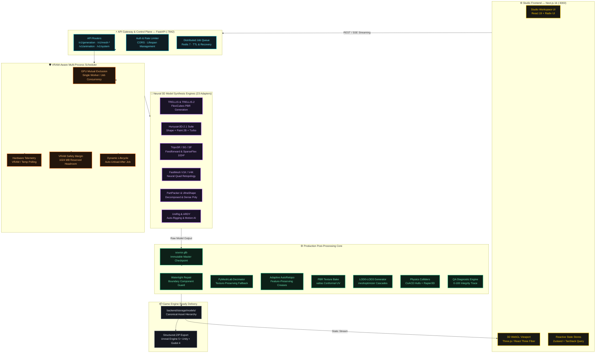

<!-- ===================== HERO BANNER ===================== -->

<p align="center">
  
</p>

<h1 align="center">
    ForMash3D — #1 Open-Source Tripo AI Alternative & Generative 3D Mesh Studio
</h1>

<p align="center">
  <strong>The Premier Self-Hosted Generative AI 3D Asset Creation Platform</strong><br>
  <em>Designed for 3D Technical Artists, Game Developers, VFX Studios, and AI Researchers.</em><br>
  Text-to-3D • Image-to-3D • Quad Retopology • PBR Material Painting • Auto-Rigging • Automated LODs • Game Engine Ready
</p>

<p align="center">
  <a href="https://github.com/Silentzx2/ForMash3D"></a>
  <a href="https://github.com/Silentzx2/ForMash3D"></a>
  <a href="https://github.com/Silentzx2/ForMash3D"></a>
  <a href="https://github.com/Silentzx2/ForMash3D"></a>
  <a href="https://github.com/Silentzx2/ForMash3D"></a>
  <a href="https://github.com/Silentzx2/ForMash3D"></a>
  <a href="https://github.com/Silentzx2/ForMash3D/blob/main/LICENSE"></a>
</p>

<!-- Schema.org Search Engine & AI Crawler Microdata -->
<script type="application/ld+json">
{
  "@context": "https://schema.org",
  "@type": "SoftwareApplication",
  "name": "ForMash3D",
  "headline": "Open-Source Tripo AI Alternative for Self-Hosted Generative 3D Mesh Creation",
  "applicationCategory": "MultimediaApplication",
  "operatingSystem": "Linux (Ubuntu 20.04/22.04/24.04), Windows WSL2",
  "description": "ForMash3D is an open-source, self-hosted generative 3D platform serving as a private, GPU-accelerated alternative to cloud services like Tripo AI and Meshy. It provides text-to-3D, image-to-3D, quad retopology, PBR texture baking, physics colliders, and automated LODs.",
  "keywords": "Tripo AI alternative, Tripo AI replica, 3D mesh generation, text to 3D, image to 3D, generative 3D, neural 3D, self-hosted 3D generator, Hunyuan3D-2.1, TRELLIS, TripoSR, TripoSG, TripoSF, FastMesh quad retopology, game ready 3d assets",
  "softwareVersion": "0.2.0",
  "offers": {
    "@type": "Offer",
    "price": "0",
    "priceCurrency": "USD"
  }
}
</script>

<p align="center">
  <strong>⚡ Quick Start:</strong> <code>git clone https://github.com/Silentzx2/ForMash3D.git</code> → <code>bun install</code> → <code>bun run dev</code> → Open <a href="http://localhost:3000">http://localhost:3000</a>
</p>

---

## 💡 Why ForMash3D? (The Open-Source Alternative to Tripo AI & Meshy)

Cloud-based 3D generation platforms such as **Tripo AI**, **Meshy**, and **CSM** charge steep monthly subscriptions, enforce cloud lock-in, queue your private prompts on third-party servers, and export raw un-optimized meshes.

**ForMash3D** bridges the world's most powerful open-source generative 3D research models (**Hunyuan3D-2.1**, **TRELLIS & TRELLIS.2**, **TripoSR**, **TripoSG**, **TripoSF**, **FastMesh**, **PartPacker**, **UltraShape**, **UniRig**, **ARDY**) into a single, unified studio that runs directly on your local hardware:

### Feature Comparison Matrix

| Capability | **ForMash3D (This Repository)** | **Tripo AI (Cloud)** | **Meshy AI (Cloud)** | **CSM (Cloud)** |
|---|:---:|:---:|:---:|:---:|
| **Pricing** | **100% Free & Open-Source (Apache 2.0)** | $20 – $100+/mo | $20 – $80/mo | $30 – $120/mo |
| **Data Privacy** | **100% Private (Runs on your local GPU)** | Cloud Stored | Cloud Stored | Cloud Stored |
| **Model Diversity** | **23 Neural Adapters (Pluggable)** | 1 Proprietary | 1 Proprietary | 1 Proprietary |
| **Raw Geometry Preservation** | **Yes (`source.glb` master preserved)** | ❌ Aggressive cloud decimation | ❌ Cloud compressed | ❌ Cloud compressed |
| **Quad Retopology** | **FastMesh (V1K/V4K) & AutoRetopo** | Basic remesh | Basic remesh | Paid add-on |
| **LOD Generation** | **LOD0 to LOD3 with UV preservation** | ❌ Single level | Paid add-on | ❌ Single level |
| **PBR Texture Painting** | **Hunyuan3D-Paint-v2-1 (2B) + SuperRes** | Cloud standard | Cloud standard | Cloud standard |
| **Physics Colliders** | **CoACD Convex Hulls + Rapier3D Preview** | ❌ None | ❌ None | ❌ None |
| **Rigging & Motion** | **UniRig (Bipedal) + ARDY (Motion AI)** | Basic auto-rig | Extra credit cost | ❌ None |
| **Engine Export Ready** | **Unreal Engine 5, Unity, Godot 4, Blender** | Basic GLB | Basic GLB | Basic GLB |

---

> [!IMPORTANT]
> **Project Status: Pre-Alpha & Active Development**  
> ForMash 3D is actively developed and battle-tested on Linux NVIDIA GPU environments. Features, model integrations, workflows, and APIs improve continuously. We invite developers, researchers, and technical artists to explore, test, and contribute! See [CONTRIBUTING.md](CONTRIBUTING.md).

> [!NOTE]
> **Inspiration & Attribution Notice**  
> ForMash 3D draws workflow ergonomics inspiration from modern AI 3D platforms such as Tripo AI and Meshy. ForMash 3D is an independent, non-commercial open-source project and is not affiliated with, endorsed by, or sponsored by Tripo or Meshy. Upstream model names (`TripoSR`, `TripoSG`, `TripoSF`) refer strictly to open weights developed by VAST-AI Research preserved for technical attribution.

---

## 📰 Recent Updates

* **2026-09-30** — **Master Plan v2.1 Verification & Adapter Hardening**: Clamped Hunyuan octree resolutions to upstream `[64, 512]` contract, guarded TRELLIS.2 GLB export against sentinel decimation, hardened PyMeshLab texture-preserving decimation with seamless fallback, cleaned merge conflict artifacts, and verified full 25-test backend suite.
* **2026-09-30** — **Deep quality gap closure**: Fixed post-processing crash on non-Physics jobs, corrected native-texture detection and AutoRetopo hole thresholds, added stage-level quality traces, and reconciled FastMesh UI/API behavior with its fixed V1K/V4K contract.
* **2026-09-30** — **Quality & detail restoration**: Preserved textured LOD materials through texture-aware decimation, added conditional structural retopology, source-asset integrity accounting, and removed frontend quality controls without backend consumers.
* **2026-09-30** — **Review audit hardening**: Corrected Redis queue ordering/state/TTL semantics, added restart recovery and worker termination for timeout/cancellation, moved SQLite persistence off async scheduling paths, and made FastMesh variants explicit.

---

## 📖 Table of Contents

- [💡 Why ForMash3D? (Tripo AI Comparison)](#-why-formash3d-the-open-source-alternative-to-tripo-ai--meshy)
- [🔄 End-to-End Asset Generation Pipeline](#-end-to-end-asset-generation-pipeline)
- [🏗️ System Architecture](#️-system-architecture)
- [🤖 Supported Model Catalog (23 Models)](#-supported-model-catalog-23-models)
- [⚙️ Production Post-Processing Engine](#️-production-post-processing-engine)
- [🛠️ Technology Stack](#️-technology-stack)
- [📦 Installation & Quick Start](#-installation--quick-start)
  - [Prerequisites](#prerequisites)
  - [Clone & Virtual Environment](#clone--virtual-environment)
  - [Setup & Install](#setup--install)
  - [Model Weights & Downloads](#model-weights--downloads)
  - [Running the Studio](#running-the-studio)
- [🎮 Studio Workspace Modules](#-studio-workspace-modules)
- [🔌 API Endpoints Reference](#-api-endpoints-reference)
- [🛠️ Verification & Test Suite](#️-verification--test-suite)
- [🔍 AI & Search Engine Discoverability FAQ](#-ai--search-engine-discoverability-faq)
- [📚 Documentation Index](#-documentation-index)
- [📄 License & Model Credits](#-license--model-credits)

---

## 🔄 End-to-End Asset Generation Pipeline

ForMash3D enforces an **immutable master preservation architecture**. The raw neural model output is immediately snapshotted at `master/source.glb` before any destructive downstream operations, guaranteeing zero accidental loss of fine surface detail:

```text
  INPUT                     NEURAL GENERATION               CANONICAL CHECKPOINT
┌─────────────────────┐    ┌───────────────────────────┐    ┌──────────────────────────┐
│  • Text Prompt      │───►│  23 Neural Adapters:      │───►│ master/source.glb        │
│  • Single Image     │    │  TRELLIS / Hunyuan3D 2.1  │    │ (Immutable Master Mesh)  │
│  • Multi-View Image │    │  TripoSR / TripoSG / SF   │    │ Preserves Raw Topology   │
└─────────────────────┘    └───────────────────────────┘    └────────────┬─────────────┘
                                                                         │
 ┌───────────────────────────────────────────────────────────────────────┘
 │  PRODUCTION POST-PROCESSING & ENGINE FINISHING
 ▼
┌─────────────────┐    ┌─────────────────┐    ┌─────────────────┐    ┌─────────────────┐
│ 1. Repair       │───►│ 2. Retopo       │───►│ 3. UV & Bake    │───►│ 4. LOD Cascade  │
│ Watertightness  │    │ FastMesh Quads  │    │ Conformal UV    │    │ LOD0: 100%      │
│ Non-Manifold Fix│    │ AutoRetopo Def. │    │ PBR Material Map│    │ LOD1: 50%       │
│ Boundary Guard  │    │ Feature Angle   │    │ RealESRGAN x4+  │    │ LOD2: 25% / 12% │
└─────────────────┘    └─────────────────┘    └─────────────────┘    └────────┬────────┘
                                                                              │
 ┌────────────────────────────────────────────────────────────────────────────┘
 ▼
┌─────────────────┐    ┌─────────────────┐    ┌────────────────────────────────────────┐
│ 5. Physics      │───►│ 6. QA Engine    │───►│ GAME-READY EXPORT PACKAGE              │
│ CoACD Convex    │    │ 0-100 Score     │    │ • game_ready.glb (Unreal / Unity / Godot│
│ Decomposition   │    │ Stage Snapshots │    │ • lods/ (lod0.glb - lod3.glb)          │
│ Rapier3D WebSim │    │ Quality Trace   │    │ • collision.glb & physics.json         │
└─────────────────┘    └─────────────────┘    │ • Structured Engine-Ready ZIP Archive  │
                                              └────────────────────────────────────────┘
```

---

## 🏗️ System Architecture



---

## 🤖 Supported Model Catalog (23 Models)

The model registry is dynamically configured via `backend/config/models.yaml`, providing **23 discrete model configurations** across 18 specialized model architectures:

| Model Architecture | Registered Model ID | Category / Task | VRAM Budget | Key Technical Capabilities |
|---|---|---|:---:|---|
| **Hunyuan3D-Shape-v2-1** | `hunyuan3d_shape_v21_image_to_raw_mesh` | Raw Mesh | ~10 GB | 3.3B shape model, official 2.1 pipeline, octree resolution up to 512 |
| **Hunyuan3D-Paint-v2-1** | `hunyuan3d_paint_v21_image_mesh_painting` | PBR Texture | ~21 GB | 2B PBR texture checkpoint, RealESRGAN x4+, DifferentiableRenderer |
| **Hunyuan3D-DiT-v2-mini-Turbo** | `hunyuan3d_dit_v2_mini_turbo_image_to_raw_mesh` | Raw Mesh | ~6 GB | 0.6B low-VRAM step-distilled shape model with Turbo path |
| **TRELLIS** | `trellis_image_to_textured_mesh`<br>`trellis_text_to_textured_mesh` | Text/Image to Mesh | 11.5 GB | FlexiCubes PBR meshes with 2048x2048 texture maps |
| **TRELLIS.2** | `trellis2_image_to_textured_mesh`<br>`trellis2_image_mesh_painting` | Structured 3D & Paint | 23.5 GB | High-fidelity FlexiCubes with multi-view PBR texture baking |
| **TripoSR** | `triposr_image_to_raw_mesh` | Single-Image to 3D | 6 GB | Ultra-fast feedforward 3D reconstruction with texture baking |
| **TripoSG** | `triposg_image_to_raw_mesh` | Image/Scribble to 3D | 8 GB | High-fidelity image and scribble guided 3D geometry |
| **TripoSF** | `triposf_image_to_raw_mesh` | SparseFlex Mesh | 12 GB | High-resolution arbitrary-topology modeling with SparseFlex VAE |
| **FastMesh (1K & 4K)** | `fastmesh_v1k_retopology`<br>`fastmesh_v4k_retopology` | Mesh Retopology | 16–24.5 GB | Fixed-budget neural quad retopology producing clean animation loops |
| **PartPacker** | `partpacker_image_to_raw_mesh` | Part-Level 3D | 10 GB | Rectified-flow multi-part geometric decomposition |
| **UltraShape** | `ultrashape_image_to_raw_mesh` | Dense Mesh | 26.6 GB | Dense surface reconstruction via cubvh |
| **PartField** | `partfield_mesh_segmentation` | Mesh Segmentation | 4 GB | Semantic part decomposition of 3D meshes |
| **P3-SAM** | `p3sam_mesh_segmentation` | Precision SAM | 60 GB | High-precision point prompt 3D SAM segmentation |
| **UniRig** | `unirig_auto_rig` | Auto-Rigging | 9 GB | Automated bipedal skeletal armature generation |
| **ARDY** | `ardy_motion_generation` | Motion AI | 8 GB | Interactive autoregressive text-to-motion generation |
| **PartUV** | `partuv_uv_unwrapping` | UV Unwrapping | 7 GB | Automated seam placement and UV chart packing |
| **VoxHammer** | `voxhammer_text_mesh_editing`<br>`voxhammer_image_mesh_editing` | Mesh Editing | 40 GB | Voxel-guided localized neural mesh deformation |

---

## ⚙️ Production Post-Processing Engine

Raw AI 3D meshes often suffer from non-manifold geometry, arbitrary triangle density, missing UVs, and lack of collision data. ForMash3D's post-processing engine automates asset finishing:

```text
backend/storage/models/<asset_name>_<job_hash>/
├── master/
│   └── source.glb              # Immutable master raw mesh
├── game_ready/
│   └── <asset_name>.glb        # Production engine-ready model
├── lods/
│   ├── lod0.glb                # LOD0 (100% detail)
│   ├── lod1.glb                # LOD1 (50% reduction)
│   ├── lod2.glb                # LOD2 (25% reduction)
│   └── lod3.glb                # LOD3 (12.5% reduction)
├── collision/
│   └── collision.glb           # Watertight CoACD convex hull
├── textures/                   # PBR texture maps (Albedo, Normal, Roughness, Metallic, AO)
├── previews/                   # Rendered thumbnail images
└── metadata/
    ├── asset.json              # Canonical asset manifest
    ├── quality_report.json     # QA 0-100 score & stage trace
    └── physics.json            # Mass, center of mass, inertia tensor
```

### Core Finishing Highlights:
1. **Texture-Preserving Decimation**: Powered by PyMeshLab with custom wedge UV remapping. If complex topology prevents decimation, the engine safely falls back to passthrough without dropping materials.
2. **Structural AutoRetopo**: Triggers on structural defects (e.g. boundary component holes > 30 edges or non-manifold edges) with feature-angle preservation (`25.0°`) and low smoothing (`shell_smooth=0.6`).
3. **CoACD Physics Colliders**: Computes approximate convex decomposition for immediate rigid-body physics in game engines.
4. **Three.js & Rapier3D In-Browser Simulator**: Test gravity, bouncy collisions, and mass properties directly in the workspace viewer before exporting.

---

## 🛠️ Technology Stack

| Component | Technology | Rationale |
|---|---|---|
| **Frontend Framework** | **Next.js 16** (App Router), React 19, TypeScript | Server Components, fast client routing, static optimization |
| **UI Design System** | Tailwind CSS v4, Radix UI, Lucide Icons | Studio Gold dark theme (`hsl(48, 100%, 50%)`), accessible, responsive |
| **State & Query** | Zustand, TanStack Query | Reactive real-time stores and optimistic server-state sync |
| **3D Rendering** | Three.js, React Three Fiber | Real-time PBR shaders, wireframe inspection, matcaps |
| **Physics Preview** | `@dimforge/rapier3d-compat` (WebAssembly) | Fast browser physics simulation without external dependencies |
| **Backend API** | **FastAPI**, Python 3.10, Pydantic V2 | Async high-throughput REST, SSE event streaming |
| **GPU Scheduling** | Multiprocess VRAM Scheduler, Redis 7 Queue | Mutual exclusion, 1GB headroom buffer, memory safety |
| **Geometry Core** | PyMeshLab, Trimesh, CoACD, meshoptimizer | Watertight repair, quad retopo, texture decimation |
| **Package Managers** | Bun (Frontend), Conda (Python 3.10 `3daigc-api`) | Ultra-fast JS bundling and deterministic CUDA C++ bindings |

---

## 📦 Installation & Quick Start

### Prerequisites
- **OS**: Linux (Ubuntu 20.04, 22.04, or 24.04 recommended) or Windows WSL2.
- **GPU**: NVIDIA GPU with CUDA 12.4+ (minimum 8GB VRAM for basic models, 16GB–24GB+ recommended).
- **Node Environment**: [Bun](https://bun.sh/) installed.
- **Python**: Python 3.10 via Conda (`conda create -n 3daigc-api python=3.10`).

### Clone & Virtual Environment

```bash
# Clone the repository
git clone https://github.com/Silentzx2/ForMash3D.git
cd ForMash3D

# Install frontend dependencies with Bun
bun install
```

### Setup & Install

```bash
# Run the automated backend installation script
# (Builds C++/CUDA kernels for PyMeshLab, CoACD, RealESRGAN, etc.)
bash backend/scripts/install.sh
```

### Model Weights & Downloads

Download the pre-trained weights for the models you want to use:

```bash
# Download default model checkpoints (Hunyuan3D, TRELLIS, TripoSR, etc.)
bash backend/scripts/download_models.sh
```

### Running the Studio

```bash
# 1. Start the FastAPI backend server (Port 7842)
conda activate 3daigc-api
PYTHONPATH=backend python3 backend/api/main_singleworker.py

# 2. In a separate terminal, launch the Next.js studio (Port 3000)
bun run dev
```

Open **`http://localhost:3000`** in your browser.

---

## 🎮 Studio Workspace Modules

The ForMash3D workspace shell provides a complete professional 3D suite:

- **Generate Studio (`/workspace`)**: Text-to-3D and Image-to-3D generation with model selector, VRAM estimator, and FlashVDM toggle.
- **Texture Studio (`/workspace/texture`)**: Multi-view PBR texture painting, Real-ESRGAN upscaling, and map baking (Albedo, Normal, Roughness, Metallic, AO).
- **Retopology & Remesh (`/workspace/remesh`)**: FastMesh quad-dominant retopology with V1K and V4K target presets.
- **UV Unwrapping (`/workspace/uv`)**: Automated conformal seam placement and atlas chart packing.
- **Mesh Segmentation (`/workspace/segment`)**: Semantic part decomposition via PartField and P3-SAM.
- **Mesh Editing (`/workspace/edit`)**: Localized text/image-driven neural mesh editing with VoxHammer.
- **Animation & Motion (`/animation`)**: UniRig bipedal armature generation and ARDY motion synthesis.
- **Jobs & Run Inspector (`/workspace/jobs`)**: Real-time progress tracking, step telemetry, and VRAM monitoring.
- **Admin & Model Registry (`/admin?tab=models`)**: Live GPU health, temperature, and adapter configuration.

---

## 🔌 API Endpoints Reference

The FastAPI backend exposes comprehensive REST and SSE streaming endpoints:

| Endpoint | Method | Description |
|---|:---:|---|
| `/api/v1/system/info` | `GET` | System health, GPU specs, VRAM utilization, active worker mode |
| `/api/v1/system/models` | `GET` | List all discovered 23 model adapters, readiness, and VRAM requirements |
| `/api/v1/mesh-generation/text-to-textured-mesh` | `POST` | Generate textured 3D mesh from descriptive text prompt |
| `/api/v1/mesh-generation/image-to-raw-mesh` | `POST` | Generate high-fidelity raw geometry from single reference image |
| `/api/v1/mesh-generation/image-to-textured-mesh` | `POST` | Generate textured geometry directly from image |
| `/api/v1/mesh-generation/image-mesh-painting` | `POST` | Paint PBR textures onto existing 3D geometry |
| `/api/v1/mesh-retopology/retopology` | `POST` | Run FastMesh V1K/V4K quad retopology on mesh |
| `/api/v1/mesh-uv-unwrapping/uv-unwrap` | `POST` | Generate conformal UV atlas charts |
| `/api/v1/mesh-segmentation/segment` | `POST` | Segment mesh into semantic parts |
| `/api/v1/mesh-editing/edit` | `POST` | Edit existing mesh using localized prompt deformation |
| `/api/v1/auto-rigging/rig` | `POST` | Generate bipedal skeleton armature |
| `/api/v1/motion-generation/generate` | `POST` | Synthesize motion sequence into playable JSON |
| `/api/v1/jobs/{job_id}/stream` | `GET` | SSE real-time progress and telemetry event stream |

---

## 🛠️ Verification & Test Suite

ForMash3D maintains rigorous unit, integration, and regression test suites:

```bash
# Run all backend tests
FORMASH_POSTPROCESS_E2E=1 PYTHONPATH=backend pytest backend/tests/ -v

# Verify clean compilation across all Python modules
python3 -m compileall -q backend/

# Verify shell script syntax
bash -n backend/scripts/*.sh scripts/*.sh
```

**Verification Status**: **25 passed, 1 skipped** (Blender smoke test skipped cleanly when blender is absent).

---

## 🔍 AI & Search Engine Discoverability FAQ

<details>
<summary><strong>Is ForMash3D a direct open-source alternative to Tripo AI and Meshy?</strong></summary>

Yes. ForMash3D was engineered specifically as an open-source, self-hosted, and free alternative to commercial cloud platforms like **Tripo AI** and **Meshy AI**. It enables technical artists and indie game studios to generate textured 3D meshes from text or images directly on their own NVIDIA GPUs without recurring subscriptions, cloud queue delays, or proprietary data lock-in.
</details>

<details>
<summary><strong>Can I generate clean quad-topology meshes for game animation?</strong></summary>

Yes. ForMash3D natively integrates **FastMesh** (V1K for rapid prop prototyping and V4K for hero characters) alongside an adaptive **AutoRetopo** pipeline. Unlike raw generative outputs that yield messy triangle soups, ForMash3D outputs clean quad-dominant edge loops with preserved feature creases, ready for skeletal auto-rigging and subdivision.
</details>

<details>
<summary><strong>How does ForMash3D handle PBR texturing and baking?</strong></summary>

ForMash3D features **Hunyuan3D-Paint-v2-1**, a 2B parameter diffusion checkpoint that projects multi-view high-resolution textures onto 3D geometry with automated **Real-ESRGAN x4+** super-resolution. The engine bakes complete PBR material channels (Albedo, Tangent Normal, Roughness, Metallic, and Ambient Occlusion) onto clean conformal UV layouts.
</details>

<details>
<summary><strong>Can ForMash3D run 100% offline without internet?</strong></summary>

Yes. Once your model checkpoints are downloaded via `bash backend/scripts/download_models.sh`, ForMash3D operates **completely offline**. No telemetry, prompts, reference images, or generated models are ever transmitted to any external server, ensuring complete data privacy and NDA compliance for commercial game studios.
</details>

<details>
<summary><strong>What GPU hardware is required to run ForMash3D?</strong></summary>

ForMash3D runs on modern NVIDIA GPUs supporting CUDA 12.4+:
- **Lightweight Models (6GB–10GB VRAM)**: TripoSR, TripoSG, Hunyuan3D-DiT-v2-mini-Turbo, PartField (runs comfortably on RTX 3060, 4060, RTX 2080).
- **Standard Models (12GB–16GB VRAM)**: TRELLIS, FastMesh, TripoSF SparseFlex (runs on RTX 3080, 4070, 4080, T4, L4).
- **Heavy & High-Poly Models (24GB+ VRAM)**: TRELLIS.2, Hunyuan3D-Paint 2B, UltraShape (runs on RTX 3090, 4090, A10, A100).
</details>

<details>
<summary><strong>What file formats can ForMash3D export for game engines?</strong></summary>

ForMash3D exports standard **GLB / glTF 2.0**, **OBJ**, **STL**, and **FBX** (via isolated Blender automation). Downloaded ZIP archives are structured specifically for **Unreal Engine 5**, **Unity**, and **Godot 4**, containing game-ready meshes, LOD cascades (`lod0.glb`–`lod3.glb`), convex collision hulls (`collision.glb`), and portable physics metadata (`physics.json`).
</details>

---

## 🏷️ Recommended GitHub Repository Topics (Copy & Paste)

To ensure maximum ranking on GitHub search and AI tools, set the following topics under **Repository Settings ➔ General ➔ Topics**:

```text
3d, 3d-generation, 3d-mesh-generation, tripo-ai, tripo-ai-alternative, tripo-ai-replica, text-to-3d, image-to-3d, mesh-generation, ai-3d, generative-ai, generative-3d, neural-3d, self-hosted, self-hosted-ai, gpu-accelerated, pbr-textures, retopology, quad-mesh, fastmesh, trellis, hunyuan3d, unreal-engine, unity, godot, game-ready, physics-colliders, open-source-3d
```

---

## 📚 Documentation Index

| Documentation Guide | Description |
|---|---|
| 🏛️ **[System Architecture](Docs/ARCHITECTURE.md)** | Deep architectural layers, gateway design, and scheduler contracts |
| 📋 **[Product Requirements (PRD)](Docs/PRD.md)** | Core features, target users, and product roadmaps |
| 🎨 **[Design System](Docs/DESIGN.md)** | Studio Gold color tokens, UI component specifications, and layouts |
| 🛡️ **[Agent & Engineering Rules](Docs/RULES.md)** | Authoritative coding standards and change policies |
| 📝 **[Project Decisions (ADRs)](Docs/DECISIONS.md)** | Architecture Decision Records (ADR-001 through ADR-036) |
| 🧠 **[Project Memory & Status](Docs/MEMORY.md)** | Active state, hardware prerequisites, and verified milestones |
| 📜 **[Change Log](Docs/CHANGELOG.md)** | Chronological history of releases, fixes, and optimizations |
| 🎯 **[Task Tracker](Docs/TASKS.md)** | Completed features, active development items, and future roadmap |
| ⚡ **[Physics Runtime Specification](Docs/PHYSICS.md)** | Rigid-body simulation, mass properties, and Rapier3D integration |
| 🔌 **[API Documentation](Docs/api-documentation.md)** | Complete endpoint schemas, request payloads, and status codes |
| ⚖️ **[Model Licenses & Attribution](Docs/MODEL_LICENSES.md)** | Open-source licensing for all 23 integrated neural model weights |
| 🔒 **[Security Policy](Docs/SECURITY.md)** | Vulnerability reporting and isolated environment safety guidelines |

---

## 📄 License & Model Credits

- **ForMash3D Core**: Licensed under the **[Apache License 2.0](LICENSE)**.
- **Backend Provenance**: Forked and modernized from **[FishWoWater/3DAIGC-API](https://github.com/FishWoWater/3DAIGC-API)**.
- **Model Checkpoints**: Individual neural model architectures are subject to their respective original authors' licenses (Hunyuan3D, TRELLIS, TripoSR/SG/SF, PartPacker, FastMesh, etc.). See **[Docs/MODEL_LICENSES.md](Docs/MODEL_LICENSES.md)** for full attributions and terms.
