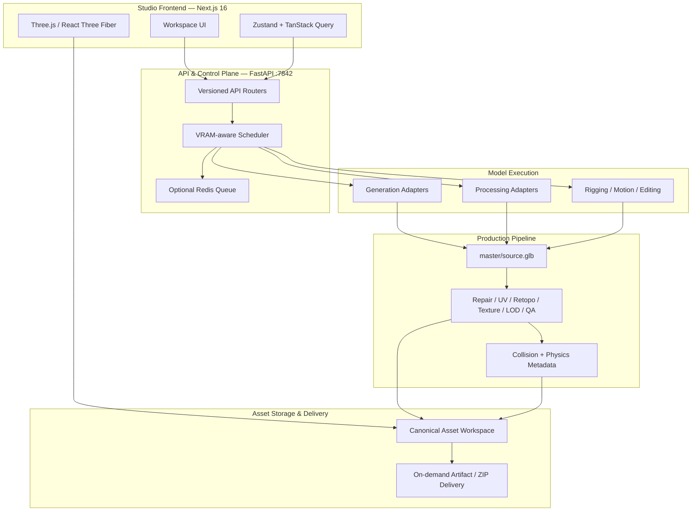

# ForMash3D

<p align="center">
  
</p>

<p align="center">
  <strong>AI-powered, self-hosted 3D generation and asset creation.</strong><br>
  Generate, process, inspect, optimize, and export 3D assets through one GPU-accelerated studio.
</p>

<p align="center">
  <a href="https://github.com/Silentzx2/ForMash3D/blob/main/LICENSE"></a>
  
  
  
  
</p>

> **Project status:** Pre-alpha / active development. APIs, model integrations, installation requirements, and UI workflows may change.

ForMash3D is an independent open-source project inspired by modern AI-assisted 3D creation workflows. It brings multiple open 3D model integrations, GPU scheduling, production-oriented post-processing, and asset delivery into a unified self-hosted application.

---

## What ForMash3D Does

ForMash3D separates **neural generation** from **asset finishing** so the original model output can remain available while downstream processing produces practical deliverables.

### Core capabilities

| Area | Capability |
|---|---|
| Generation | Image-to-3D and text-to-3D workflows |
| Models | TRELLIS, TRELLIS.2, Hunyuan3D, TripoSR/SG/SF, PartPacker, UltraShape and more |
| Texturing | Hunyuan3D-Paint-v2-1, PBR material workflows, texture upscaling |
| Geometry | Repair, decimation, adaptive AutoRetopo and UV processing |
| Optimization | LOD0–LOD3 generation with source preservation |
| Physics | Collision generation, physics metadata and browser-side Rapier preview |
| Animation | UniRig auto-rigging and ARDY motion generation |
| Editing | Localized mesh editing through supported model adapters |
| Delivery | GLB/glTF and other supported formats plus structured asset packages |
| Runtime | VRAM-aware scheduling, GPU mutual exclusion and optional Redis multi-worker mode |

## Generation → Production Workflow

```text
Prompt / Image / Mesh
        │
        ▼
┌───────────────────────┐
│  Model Adapter        │
│  TRELLIS / Hunyuan /  │
│  Tripo / PartPacker…  │
└───────────┬───────────┘
            │ raw model output
            ▼
┌───────────────────────┐
│ master/source.glb     │
│ immutable source      │
└───────────┬───────────┘
            │
            ▼
┌───────────────────────┐
│ Production Processing │
│ repair · UV · texture │
│ retopo · LOD · QA     │
└───────────┬───────────┘
            │
            ▼
┌───────────────────────┐
│ Game-ready assets     │
│ GLB · textures · LODs │
│ collision · metadata  │
└───────────────────────┘
```

The immutable master is the quality boundary: downstream processing operates on derived data rather than silently replacing the model-native output.

---

## System Architecture



---

## Model Integrations

The model registry is configuration-driven through `backend/config/models.yaml`.

| Model family | Primary use |
|---|---|
| Hunyuan3D-Shape-v2-1 | Image-to-raw-mesh generation |
| Hunyuan3D-Paint-v2-1 | PBR texture generation / painting |
| Hunyuan3D-DiT-v2-mini-Turbo | Lower-VRAM shape generation |
| TRELLIS / TRELLIS.2 | Text/image-to-3D and textured mesh generation |
| TripoSR / TripoSG / TripoSF | Image-to-3D reconstruction |
| PartPacker | Part-level 3D generation |
| UltraShape | Dense arbitrary-topology reconstruction |
| PartField / P3-SAM | Mesh segmentation |
| FastMesh | V1K/V4K neural retopology |
| PartUV | UV unwrapping |
| UniRig | Automatic rigging |
| ARDY | Motion generation |
| VoxHammer | Localized mesh editing |

Model availability depends on installed source trees, checkpoints, hardware, and the canonical model manifest.

---

## Requirements

- Linux, preferably Ubuntu 20.04 / 22.04 / 24.04
- NVIDIA GPU with a CUDA 12.4-compatible driver
- Python 3.10
- Conda environment: `3daigc-api`
- PyTorch 2.6.0 + CUDA 12.4
- Bun for frontend development
- Git

VRAM requirements vary substantially by model. A production NVIDIA runtime is required for real model inference.

---

## Installation

### 1. Clone

```bash
git clone https://github.com/Silentzx2/ForMash3D.git
cd ForMash3D
```

### 2. Setup

```bash
bash scripts/setup.sh
```

The setup flow prepares the environment, downloads maintained release wheels when available, installs frontend dependencies, and delegates backend installation to `backend/scripts/install.sh`.

### 3. Start

```bash
bash scripts/start.sh
```

Services:

- Frontend: `http://localhost:3000`
- Backend: `http://localhost:7842`
- Swagger UI: `http://localhost:7842/docs`
- Health: `http://localhost:7842/health`

### Model checkpoints

```bash
bash backend/scripts/download_models.sh
```

Select only the models required for your hardware and workflow.

---

## Repository Structure

```text
ForMash3D/
├── app/                    # Next.js App Router
├── components/             # Shared UI components
├── features/               # Workspace and feature modules
├── services/               # Frontend API / persistence services
├── stores/                 # Zustand stores
├── backend/
│   ├── adapters/           # Model adapters
│   ├── api/                # FastAPI routers and entry points
│   ├── config/             # System and model manifests
│   ├── core/               # Scheduler and shared backend logic
│   ├── postprocess/        # Production asset finishing
│   ├── scripts/            # Backend installation and model tooling
│   ├── storage/            # Runtime asset storage
│   └── thirdparty/         # Integrated third-party source trees
├── Docs/                   # Project documentation
├── assets/                 # Repository presentation assets
└── scripts/                # Project-level setup/start/verification scripts
```

---

## Documentation

| Document | Purpose |
|---|---|
| [Architecture](Docs/ARCHITECTURE.md) | Runtime layers, data flow, scheduling and storage |
| [System Blueprint](Docs/SYSTEM-BLUEPRINT.md) | Detailed implementation contracts |
| [Product Requirements](Docs/PRD.md) | Product scope and requirements |
| [Design System](Docs/DESIGN.md) | UI tokens and interaction patterns |
| [API Documentation](Docs/api-documentation.md) | REST endpoints and contracts |
| [Physics](Docs/PHYSICS.md) | Collision and physics runtime |
| [Tasks](Docs/TASKS.md) | Current work and verification state |
| [Decisions](Docs/DECISIONS.md) | Architecture decision records |
| [Security](Docs/SECURITY.md) | Security requirements |
| [Contributing](CONTRIBUTING.md) | Development workflow |

---

## Verification

```bash
npx tsc --noEmit
bun run lint
bun run build
python3 -m compileall -q backend/
python3 scripts/verify_contracts.py
bash -n backend/scripts/*.sh scripts/*.sh
```

Static checks do not replace GPU/inference validation.

---

## Project Principles

- **Source preservation:** keep model-native output available as the immutable master.
- **Explicit contracts:** model capabilities, VRAM requirements, routes and output formats come from canonical configuration.
- **Self-hosted by design:** generated assets can remain on infrastructure controlled by the operator.
- **Minimal abstractions:** prefer existing project patterns and dependencies.
- **Upstream respect:** preserve third-party licenses, attribution, and model-specific terms.
- **Production-minded processing:** repair, optimization, validation, and delivery are first-class stages.

ForMash3D is independent and inspired by the broader AI/3D tooling ecosystem. It is not affiliated with or endorsed by third-party model or platform owners referenced in the repository.

---

## License

The ForMash3D core is licensed under the [Apache License 2.0](LICENSE).

Third-party model code, checkpoints, and dependencies retain their own licenses and attribution requirements.

## Contributing

See [CONTRIBUTING.md](CONTRIBUTING.md) and [RULES.md](RULES.md).
